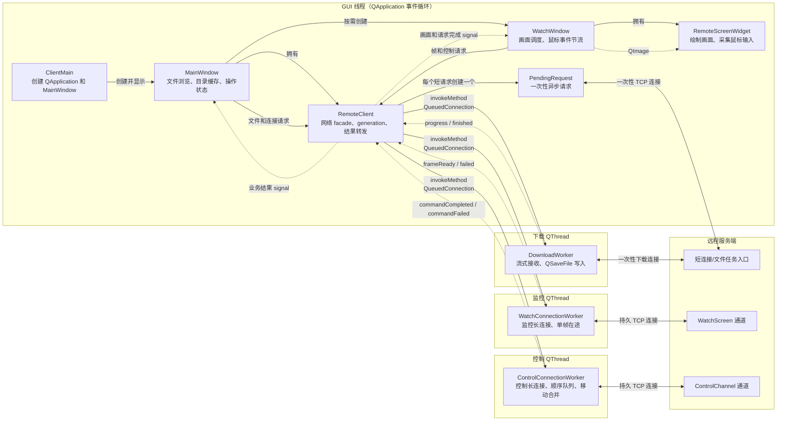

# 客户端系统架构

本文用于说明客户端组件职责、线程边界、对象通信和网络连接模型。推荐阅读顺序参见
[项目代码学习指南](StudyGuide.md)。

## 总体架构

图中的实线表示对象创建、函数调用或跨线程任务投递，虚线表示 signal 返回。

## 线程划分

| 线程 | 主要对象 | 职责 |
| --- | --- | --- |
| GUI 线程 | `MainWindow`、`WatchWindow`、`RemoteClient`、`PendingRequest` | 界面、短连接异步请求和业务结果转发 |
| 监控线程 | `WatchConnectionWorker` | 维护监控长连接，一次只请求一帧 |
| 控制线程 | `ControlConnectionWorker` | 维护控制长连接，按顺序发送命令并合并鼠标移动 |
| 下载线程 | `DownloadWorker` | 流式接收文件并写入 `QSaveFile` |

客户端只有一个 GUI 线程，`MainWindow` 和 `WatchWindow` 共用
`QApplication::exec()` 启动的事件循环。创建多个窗口不会自动创建多个 GUI 线程。

`PendingRequest` 也位于 GUI 线程。它使用异步 `QTcpSocket`，由 Qt 事件循环驱动，因此
等待网络数据时不会同步阻塞界面。监控、控制和下载属于持续时间较长或负载较重的任务，
所以分别交给三个常驻工作线程。

## 连接模型

| 模型 | 客户端实现 | 用途 | 生命周期 |
| --- | --- | --- | --- |
| 一次性短连接 | `PendingRequest` | 连接测试、磁盘、目录、打开和删除 | 每个逻辑请求创建一个对象 |
| 一次性下载连接 | `DownloadWorker` | 流式下载文件 | 一次只执行一个下载 |
| 监控长连接 | `WatchConnectionWorker` | 持续请求远程画面 | 监控窗口关闭时断开 |
| 控制长连接 | `ControlConnectionWorker` | 鼠标、模拟锁定和解锁 | 控制窗口关闭时断开 |

`RemoteClient` 是 GUI 与网络实现之间的 facade。GUI 只调用业务接口，不直接操作 worker
或 socket。监控和控制结果返回后，`RemoteClient` 会根据 generation 丢弃旧会话结果；
有效结果以及下载进度再通过业务 signal 转发给界面。
