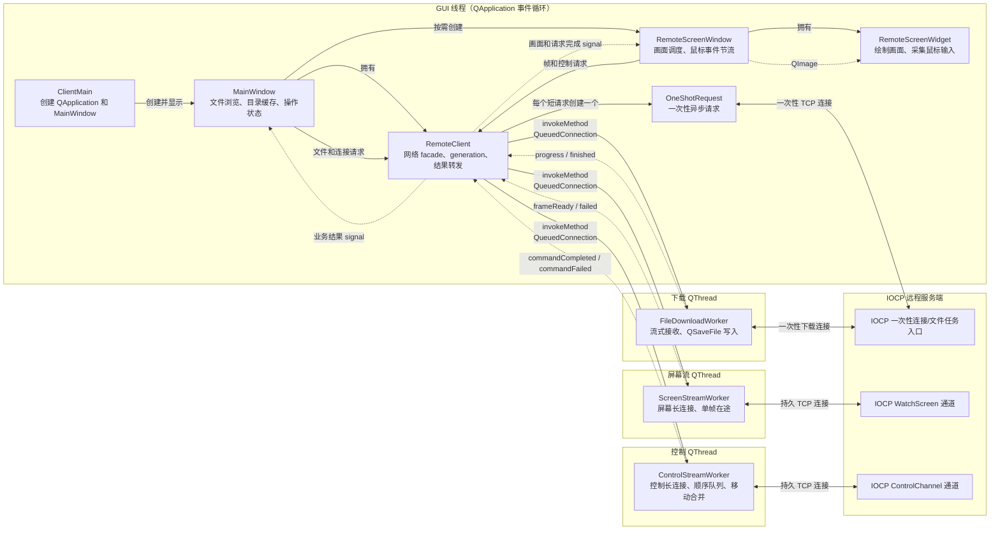

# 客户端系统架构

本文用于说明客户端组件职责、线程边界、对象通信和网络连接模型。推荐阅读顺序参见
[项目代码学习指南](StudyGuide.md)。

Packet、命令和 payload 布局参见 [远程控制协议参考](ProtocolReference.md)。

第一次阅读只需抓住三点：GUI 不等待同步网络操作；每个 worker 只在所属线程操作自己的
`QTcpSocket`；`RemoteClient` 是界面与各网络实现之间的唯一业务入口。

## 总体架构

图中的实线表示对象创建、函数调用或跨线程任务投递，虚线表示 signal 返回。
服务端内部的 completion worker、任务池和连接生命周期参见
[IOCP 服务端系统架构](ServerArchitecture.md)。

## 线程划分

| 线程 | 主要对象 | 职责 |
| --- | --- | --- |
| GUI 线程 | `MainWindow`、`RemoteScreenWindow`、`RemoteClient`、`OneShotRequest` | 界面、短连接异步请求和业务结果转发 |
| 屏幕流线程 | `ScreenStreamWorker` | 维护屏幕长连接，一次只请求一帧 |
| 控制线程 | `ControlStreamWorker` | 维护控制长连接，按顺序发送命令并合并鼠标移动 |
| 下载线程 | `FileDownloadWorker` | 流式接收文件并写入 `QSaveFile` |

客户端只有一个 GUI 线程，`MainWindow` 和 `RemoteScreenWindow` 共用
`QApplication::exec()` 启动的事件循环。创建多个窗口不会自动创建多个 GUI 线程。

`OneShotRequest` 也位于 GUI 线程。它使用异步 `QTcpSocket`，由 Qt 事件循环驱动，因此
等待网络数据时不会同步阻塞界面。监控、控制和下载属于持续时间较长或负载较重的任务，
所以分别交给三个常驻工作线程。

## 连接模型

| 模型 | 客户端实现 | 用途 | 生命周期 |
| --- | --- | --- | --- |
| 一次性短连接 | `OneShotRequest` | 连接测试、磁盘、目录、打开和删除 | 每个逻辑请求创建一个对象 |
| 一次性下载连接 | `FileDownloadWorker` | 流式下载文件 | 一次只执行一个下载 |
| 监控长连接 | `ScreenStreamWorker` | 持续请求远程画面 | 监控窗口关闭时断开 |
| 控制长连接 | `ControlStreamWorker` | 鼠标、模拟锁定和解锁 | 控制窗口关闭时断开 |

`RemoteClient` 是 GUI 与网络实现之间的 facade。GUI 只调用业务接口，不直接操作 worker
或 socket。监控和控制结果返回后，`RemoteClient` 会根据 generation 丢弃旧会话结果；
有效结果以及下载进度再通过业务 signal 转发给界面。

## 对象所有权与关闭顺序

| 对象 | 创建者/所有者 | 生命周期 |
| --- | --- | --- |
| `RemoteClient` | `MainWindow` 的 QObject parent 关系 | 随主窗口销毁 |
| `OneShotRequest` | 以 `RemoteClient` 为 parent 自管理 | 回调完全退出后 `deleteLater()` |
| 三个 `QThread` | `RemoteClient` | 析构中 `quit()` 后 `wait()` |
| 三个 worker | 创建后 `moveToThread()` | 对应线程发出 `finished` 后 `deleteLater()` |
| `RemoteScreenWindow` | `MainWindow` 按需创建并作为 parent | 关闭时停止两条流并保留窗口，随主窗口销毁 |

`RemoteClient` 析构时，先使用 `Qt::BlockingQueuedConnection` 让 worker 在自己的线程中执行
`shutdown()`，然后退出并等待线程。顺序不能颠倒：先停止事件循环会让 worker 无法处理清理任务，
直接从 GUI 线程调用 `shutdown()` 又会违反 socket 的线程归属。

## 结果有效性

endpoint、屏幕流和控制流分别使用独立 generation。异步任务开始时捕获 generation，结果返回
GUI 线程后只有与当前值匹配才会继续转发。修改 host/port 会同时让三个范围失效；停止屏幕或
控制流只影响对应会话，不会误伤其他请求。

`m_screenFramePending` 是 GUI 侧的单帧调度状态，不是 worker 连接状态。它从请求发出保持到该帧
成功、失败或结束，避免按钮状态或定时调度在帧间短暂失效。

## 推荐代码阅读顺序

1. `ClientMain.cpp → MainWindow.cpp`：找到界面入口和业务操作。
2. `RemoteClient.cpp`：先看构造、析构和 `testConnection()`，再看跨线程 `invokeMethod()`。
3. `OneShotRequest`：理解异步短连接、缓冲区解析和 `CallbackScope`。
4. `ScreenStreamWorker`、`ControlStreamWorker`、`FileDownloadWorker`：分别理解三种长期任务。
5. `RemoteScreenWindow`、`RemoteScreenWidget`：最后回到帧调度、绘制和鼠标坐标转换。
