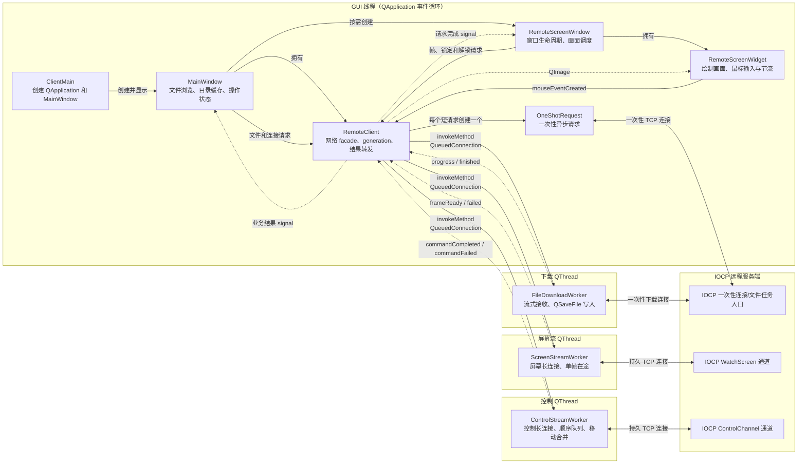

# 客户端系统架构

本文用于说明客户端组件职责、线程边界、对象通信和网络连接模型。推荐阅读顺序参见
[项目代码学习指南](StudyGuide.md)。

Packet、命令和 payload 布局参见 [远程控制协议参考](ProtocolReference.md)。
跨组件的设计模式、生命周期原则和工程取舍参见
[设计思想与设计模式](DesignPrinciples.md)。

第一次阅读只需抓住三点：GUI 不等待同步网络操作；每个 worker 只在所属线程操作自己的
`QTcpSocket`；`RemoteClient` 是界面与各网络实现之间的唯一业务入口。

## 总体架构



图中的实线表示对象创建、函数调用或跨线程任务投递，虚线表示 signal 返回。
服务端内部的 completion worker、任务池和连接生命周期参见
[IOCP 服务端系统架构](ServerArchitecture.md)。

## 线程划分

| 线程 | 主要对象 | 职责 |
| --- | --- | --- |
| GUI 线程 | `MainWindow`、`RemoteScreenWindow`、`RemoteScreenWidget`、`RemoteClient`、`OneShotRequest` | 界面、短连接异步请求和业务结果转发 |
| 屏幕流线程 | `ScreenStreamWorker` | 维护屏幕长连接，一次只请求一帧 |
| 控制线程 | `ControlStreamWorker` | 维护控制长连接，按顺序发送命令并合并鼠标移动 |
| 下载线程 | `FileDownloadWorker` | 流式接收文件并写入 `QSaveFile` |

客户端只有一个 GUI 线程，`MainWindow` 和 `RemoteScreenWindow` 共用
`QApplication::exec()` 启动的事件循环。创建多个窗口不会自动创建多个 GUI 线程。

`OneShotRequest` 也位于 GUI 线程。它使用异步 `QTcpSocket`，由 Qt 事件循环驱动，因此
等待网络数据时不会同步阻塞界面。监控、控制和下载属于持续时间较长或负载较重的任务，
所以分别交给三个常驻工作线程。

## 连接模型

| 模型 | 客户端实现 | 用途 | 生命周期 |
| --- | --- | --- | --- |
| 一次性短连接 | `OneShotRequest` | 连接测试、磁盘、目录、打开和删除 | 每个逻辑请求创建一个对象 |
| 一次性下载连接 | `FileDownloadWorker` | 流式下载文件 | 一次只执行一个下载 |
| 监控长连接 | `ScreenStreamWorker` | 持续请求远程画面 | 监控窗口关闭时断开 |
| 控制长连接 | `ControlStreamWorker` | 鼠标、模拟锁定和解锁 | 控制窗口关闭时断开 |

`RemoteClient` 是 GUI 与网络实现之间的 facade。GUI 只调用业务接口，不直接操作 worker
或 socket。监控、控制和下载结果返回后，`RemoteClient` 会根据各自的 generation 丢弃旧结果；
只有仍属于当前操作的业务结果和下载进度才会转发给界面。

## 对象所有权与关闭顺序

| 对象 | 创建者/所有者 | 生命周期 |
| --- | --- | --- |
| `RemoteClient` | `MainWindow` 的 QObject parent 关系 | 随主窗口销毁 |
| `OneShotRequest` | 以 `RemoteClient` 为 parent 自管理 | 回调完全退出后 `deleteLater()` |
| 三个 `QThread` | `RemoteClient` | 析构中由 worker 收尾回调执行 `quit()`，随后由调用线程 `wait()` |
| 三个 worker | 创建后 `moveToThread()` | 对应线程发出 `finished` 后 `deleteLater()` |
| `RemoteScreenWindow` | `MainWindow` 按需创建并作为 parent | 关闭时停止两条流并保留窗口，随主窗口销毁 |
| `RemoteScreenWidget` | `RemoteScreenWindow` 创建，screen container 作为 parent | 随远程屏幕窗口销毁 |

`RemoteClient` 析构时，通过 `Qt::QueuedConnection` 为每个 worker 投递一个收尾回调。该回调在
worker 自己的线程中先执行 `shutdown()`，再退出当前线程的事件循环；析构线程只负责 `wait()`。
把清理和 `quit()` 放在同一个队列回调中，既保证 socket 等资源仍由所属线程释放，也避免两段式
阻塞关闭之间的时序窗口。

关闭远程屏幕窗口时，窗口先停止帧调度，再让 `RemoteScreenWidget` 停止鼠标移动定时器并丢弃
尚未发送的位置，最后关闭屏幕流和控制流。这个顺序可以防止窗口关闭后，延迟的鼠标移动再次调用
`RemoteClient::sendMouseEvent()` 并重新建立控制连接。

## 鼠标事件顺序与节流

`RemoteScreenWidget` 将高频移动事件限制为约每 16 ms 发送一次，并且只保留定时窗口内最新的
鼠标位置。按下、释放和双击属于不可合并的离散事件；发送这些事件前，widget 会立即刷新尚未
发送的移动事件并停止对应定时器，因此控制线程接收到的顺序仍然是“移动到目标位置，再执行
按键动作”，也不会由旧的定时回调重复发送该位置。

`ControlStreamWorker` 还会合并队列中相邻的纯移动命令，但不会跨越按下、释放、双击、锁定或
解锁等有顺序含义的命令。这两层处理分别控制 GUI 事件产生速率和网络队列积压。

## 结果有效性

endpoint、下载、屏幕流和控制流分别使用 generation。异步任务开始时捕获对应值，结果返回
GUI 线程后只有与当前值匹配才会继续转发。修改 host/port 会让 endpoint 及三个长期操作范围
失效；停止屏幕或控制流只影响对应会话，不会误伤其他请求。

`m_screenFramePending` 是 GUI 侧的单帧调度状态，不是 worker 连接状态。它从请求发出保持到该帧
成功、失败或结束，避免按钮状态或定时调度在帧间短暂失效。

下载结果同时携带 endpoint generation 和独立的 download generation。修改 host/port 时，客户端
会递增两者并在下载线程中取消旧传输；开始新下载时只递增 download generation。因此旧进度、
旧完成或旧取消结果都不能结束后续下载，未提交的 `QSaveFile` 临时内容也会被删除。

```text
旧下载 E0/D1 进行中
  → endpoint 改为 E1，download generation 变为 D2，并排队取消 E1/D2
  → 若立即启动新下载，download generation 再变为 D3
  → 旧进度 E0/D1 被丢弃
  → 旧取消 E1/D2 被丢弃
  → 只有新下载 E1/D3 能更新当前 GUI
```

取消没有额外的协议命令：worker 在自己的线程取消 `QSaveFile`、中止下载 socket，并通过本地
signal 报告结果。服务端从 TCP 断开完成通知中回收对应下载连接。

`OneShotRequest` 还需要防止模态对话框的嵌套事件循环在回调返回前处理对象删除；完整案例和
`CallbackScope` 状态转换参见 [项目代码学习指南](StudyGuide.md) 的客户端网络阶段。

## 源码入口

1. [ClientMain.cpp](../src/client/ClientMain.cpp) → [MainWindow.cpp](../src/client/MainWindow.cpp)：界面入口和业务操作。
2. [RemoteClient.cpp](../src/client/RemoteClient.cpp)：网络 facade、线程启停和 `OneShotRequest`。
3. [ScreenStreamWorker.cpp](../src/client/ScreenStreamWorker.cpp)、
   [ControlStreamWorker.cpp](../src/client/ControlStreamWorker.cpp)、
   [FileDownloadWorker.cpp](../src/client/FileDownloadWorker.cpp)：三种长期任务。
4. [RemoteScreenWindow.cpp](../src/client/RemoteScreenWindow.cpp) 和
   [RemoteScreenWidget.cpp](../src/client/RemoteScreenWidget.cpp)：帧调度、绘制和鼠标坐标转换。
