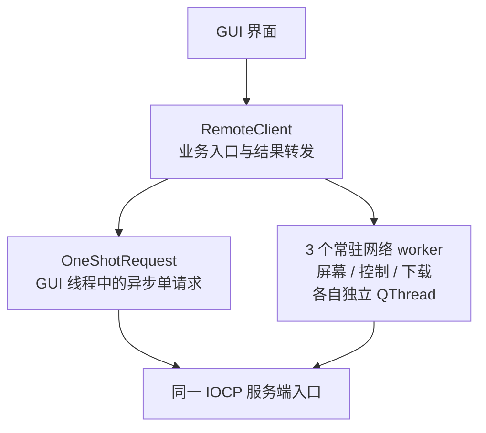

# 客户端系统架构

本文用于说明客户端组件职责、线程边界、对象通信和网络连接模型。源码阅读顺序统一参见
[阶段三：客户端网络与线程](StudyGuide.md#阶段三客户端网络与线程)和
[阶段四：远程屏幕交互](StudyGuide.md#阶段四远程屏幕交互)。

Packet、命令和 payload 布局参见 [远程控制协议参考](ProtocolReference.md)。
跨组件的设计模式、生命周期原则和工程取舍参见
[设计思想与设计模式](DesignPrinciples.md)。

第一次阅读只需抓住三点：GUI 线程不执行同步网络等待；每个 worker 只在所属线程操作自己的
`QTcpSocket`；单请求连接和持久连接采用不同的对象生命周期。

## 总体架构



箭头只表示请求的主要流向，处理结果通过 Qt signal 返回。图只突出业务入口和线程边界；
各连接的生命周期与 worker 职责见下文。服务端内部的 completion worker、任务池和连接生命周期参见
[IOCP 服务端系统架构](ServerArchitecture.md)。

## 线程划分

- **GUI 线程**
  - 主要对象：`MainWindow`、`RemoteScreenWindow`、`RemoteScreenWidget`、`RemoteClient` 和
    `OneShotRequest`。
  - 职责：维护界面状态，执行单请求连接的异步操作，并转发业务结果。
- **屏幕流线程**
  - 主要对象：`ScreenStreamWorker`。
  - 职责：维护屏幕长连接，并保证一次只请求一帧。
- **控制线程**
  - 主要对象：`ControlStreamWorker`。
  - 职责：维护控制长连接，按顺序发送命令并合并相邻的鼠标移动。
- **下载线程**
  - 主要对象：`FileDownloadWorker`。
  - 职责：流式接收文件并写入 `QSaveFile`。

客户端只有一个 GUI 线程，`MainWindow` 和 `RemoteScreenWindow` 共用
`QApplication::exec()` 启动的事件循环。创建多个窗口不会自动创建多个 GUI 线程。

`OneShotRequest` 也位于 GUI 线程。它使用异步 `QTcpSocket`，由 Qt 事件循环驱动，因此
等待网络数据时不会同步阻塞界面。监控、控制和下载属于持续时间较长或负载较重的任务，
所以分别交给三个常驻工作线程。

## 连接模型

- **单请求连接**：由 `OneShotRequest` 实现，用于连接测试、磁盘、目录、打开和删除。每个逻辑请求
  创建一个对象，响应完成后关闭对应连接。
- **单请求下载连接**：由常驻的 `FileDownloadWorker` 实现。每次下载创建一条专用连接，同一时间只
  执行一个下载；连接结束后 worker 线程继续保留。
- **监控长连接**：由 `ScreenStreamWorker` 实现，用于持续请求远程画面，在监控窗口关闭时断开。
- **控制长连接**：由 `ControlStreamWorker` 实现，用于鼠标、模拟锁定和解锁，在控制窗口关闭时断开。

“单请求”只描述客户端的连接生命周期，不表示操作一定很快，也不等同于服务端的连接 role。所有
连接都进入同一个 listener；服务端再根据首个命令把 `TestConnection`、`ListDrives`、`RunFile`
分类为 `OneShot`，把 `ListDirectory`、`DownloadFile`、`DeleteFile` 分类为 `FileTransfer`。

GUI 只调用 `RemoteClient` 的业务接口，不直接操作 worker 或 socket。它负责选择对应的网络实现，
校验异步结果的 generation，并把仍属于当前操作的结果转发给界面。

### 控制流握手与命令顺序

`ControlStreamWorker` 首次收到控制命令时按以下状态建立持久连接：

```text
Disconnected ──► Connecting ──► Handshaking ──► Ready
```

TCP 连接建立后，worker 先发送 `ControlChannel` 握手；只有成功状态包才能把连接推进到 `Ready`。
业务命令先进入有序队列，`m_inFlightCommand` 只保存已经发送且正在等待响应的一个命令。收到匹配
响应并清空它以后，worker 才发送下一条命令，因此无需额外的 `AwaitingResponse` 枚举也能保证
单命令在途。连接失败或超时时，当前命令和仍在排队的命令会一起失败并清理。

## 结果有效性

四类 generation 分别保护不同的异步结果范围：

- **endpoint generation**：由 `OneShotRequest` 和下载任务捕获，用于丢弃旧 host/port 的结果。
- **download generation**：标识当前下载或取消操作；与 endpoint generation 同时匹配时，下载进度和
  完成结果才会进入 GUI。
- **screen stream generation**：标识当前监控会话，只过滤屏幕帧、失败和单帧完成通知。
- **control stream generation**：标识当前控制会话，只过滤鼠标、锁定和解锁命令的结果。

修改 host/port 会推进 endpoint 和 download generation，并通过停止两条流分别推进 screen stream
和 control stream generation，因此四类旧结果都会失效。单独停止屏幕流或控制流时只推进对应的
stream generation，不会影响其他请求。

`m_screenFramePending` 是 `RemoteClient` 中的单帧在途标志，不是 worker 连接状态。它在请求发出时
置为 true，在该帧成功、失败或结束时恢复为 false，用于防止同一帧完成前重复投递第二个请求。
两帧之间的等待和下一帧启动由 `RemoteScreenWindow` 的 single-shot timer 负责；该标志不参与
按钮状态判断。

下载结果同时携带 endpoint generation 和独立的 download generation。修改 host/port 时，客户端
会递增两者，并向下载线程投递带有新 generation 的取消操作；开始新下载时只递增 download
generation。下面按发生顺序说明旧进度和取消结果为什么不会结束后续下载：

1. **原下载仍在传输（`E0/D1`）**：进度和完成结果暂时属于当前下载。
2. **endpoint 改变（`E1/D2`）**：已经排队的 `E0/D1` 结果因 endpoint 不匹配而被丢弃；取消操作
   使用 `E1/D2` 报告结果。
3. **随后启动新下载（`E1/D3`）**：`E1/D2` 的取消结果也变为过期；只有 `E1/D3` 可以更新当前 GUI。

取消结果使用 `E1/D2`，是为了在没有后续下载时仍能匹配当前 generation，让 GUI 正常结束原下载
状态；一旦新下载把当前值推进到 `D3`，该取消结果就会自然变成过期结果。

取消没有额外的协议命令：worker 在自己的线程取消 `QSaveFile`、中止下载 socket，并通过本地
signal 报告结果。服务端从 TCP 断开完成通知中回收对应下载连接。

`OneShotRequest` 还需要防止模态对话框的嵌套事件循环在回调返回前处理对象删除；完整案例和
`CallbackScope` 状态转换参见
[阶段三：客户端网络与线程](StudyGuide.md#阶段三客户端网络与线程)。

## 对象所有权与关闭顺序

- **`RemoteClient`**：通过 QObject parent 关系归 `MainWindow` 所有，随主窗口销毁。
- **`OneShotRequest`**：以 `RemoteClient` 为 parent 自管理，在回调完全退出后调用 `deleteLater()`。
- **三个 `QThread`**：归 `RemoteClient` 所有。析构时由 worker 收尾回调执行 `quit()`，随后由调用
  线程执行 `wait()`。
- **三个 worker**：创建后通过 `moveToThread()` 迁移到对应线程；线程发出 `finished` 后调用
  `deleteLater()`。
- **`RemoteScreenWindow`**：由 `MainWindow` 按需创建并作为其子对象。关闭时停止两条流并保留窗口，
  最终随主窗口销毁。
- **`RemoteScreenWidget`**：由 `RemoteScreenWindow` 创建，以 screen container 为 parent，随远程
  屏幕窗口销毁。

`RemoteClient` 析构时，通过 `Qt::QueuedConnection` 为每个 worker 投递一个收尾回调。该回调在
worker 自己的线程中先执行 `shutdown()`，再退出当前线程的事件循环；析构线程只负责 `wait()`。
把清理和 `quit()` 放在同一个队列回调中，既保证 socket 等资源仍由所属线程释放，也避免两段式
阻塞关闭之间的时序窗口。

关闭远程屏幕窗口时，窗口先停止帧调度，再让 `RemoteScreenWidget` 停止鼠标移动定时器并丢弃
尚未发送的位置，最后关闭屏幕流和控制流。这个顺序可以防止窗口关闭后，延迟的鼠标移动再次调用
`RemoteClient::sendMouseEvent()` 并重新建立控制连接。

## 鼠标事件顺序与节流

`RemoteScreenWidget` 将高频移动事件限制为约每 16 ms 发送一次，并且只保留定时窗口内最新的
鼠标位置。按下、释放和双击属于不可合并的离散事件；发送这些事件前，widget 会立即刷新尚未
发送的移动事件并停止对应定时器，因此控制线程接收到的顺序仍然是“移动到目标位置，再执行
按键动作”，也不会由旧的定时回调重复发送该位置。

`ControlStreamWorker` 还会合并队列中相邻的纯移动命令，但不会跨越按下、释放、双击、锁定或
解锁等有顺序含义的命令。这两层处理分别控制 GUI 事件产生速率和网络队列积压。
