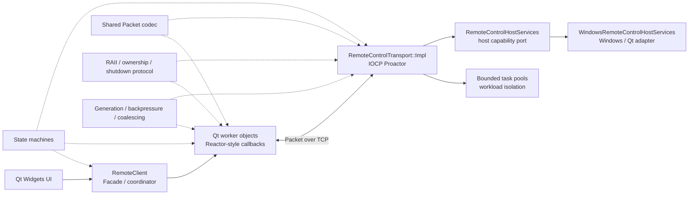

# 设计思想与设计模式

本文说明 Remote Control Qt 为什么采用当前结构，以及修改代码时必须保持哪些设计约束。它关注
职责边界、异步协作、资源所有权、状态转换和工程取舍，不重复功能操作步骤、完整线程图或协议字段。

- 项目实现了什么：参见[项目功能与技术实现](FeaturesAndDesign.md)。
- 客户端对象和线程如何连接：参见[客户端系统架构](ClientArchitecture.md)。
- 服务端 IOCP 如何工作：参见[IOCP 服务端系统架构](ServerArchitecture.md)。
- Packet 和命令如何编码：参见[远程控制协议参考](ProtocolReference.md)。

文中使用“体现某种模式”或“某种风格”，表示代码借用了该模式的核心思想；除非明确说明，
不代表项目实现了教科书中的完整 GoF 模式。

## 阅读路线

| 阅读目标 | 建议章节 |
| --- | --- |
| 用 5 分钟建立整体认识 | [设计总览](#设计总览) |
| 已经读完客户端代码 | [客户端设计](#客户端设计)和[跨模块设计思想](#跨模块设计思想) |
| 正在学习 IOCP 服务端 | [服务端设计](#服务端设计)和[并发关闭案例](#并发关闭) |
| 理解一个功能如何组合多种原则 | [典型功能如何组合这些思想](#典型功能如何组合这些思想) |
| 准备修改项目代码 | 对应设计章节和[修改代码时的检查清单](#修改代码时的检查清单) |

## 设计总览

项目贯穿以下原则：

| 原则 | 要解决的问题 | 当前做法 |
| --- | --- | --- |
| 按变化原因划分边界 | UI、协议、网络和 Windows API 相互污染 | UI 调用客户端 facade；transport 用 PIMPL 隔离 Windows 网络；Windows 主机能力留在 adapter |
| 用消息跨越线程 | GUI 与 worker 共享可变对象容易产生竞态 | Qt signal/slot 和 `Qt::QueuedConnection` 投递不可变参数或值快照 |
| 显式表达生命周期 | 多个布尔值容易组合出非法状态 | 为请求、连接、下载、目录缓存和屏幕帧建立枚举状态机 |
| 所有资源都必须有所有者 | 异步回调容易访问已经释放的对象 | Qt parent、`std::unique_ptr`、`std::shared_ptr`、`std::weak_ptr` 和 RAII 协同管理 |
| 高频或重负载的关键队列应有上限 | 慢客户端或高频输入可能无限占用内存 | 有界任务池、连接配额、发送积压限制、单帧在途和鼠标移动合并 |
| 完成事件驱动下一步 | 固定频率生产会让慢消费者持续积压 | 一帧或一批发送完成后，才调度下一帧、目录批次或下载块 |
| 关闭是一段协议 | 单独调用 `quit()` 或关闭 handle 不能保证安全 | 先拒绝新工作，再清理/取消，排空完成通知，最后 join 和释放资源 |

## 客户端设计

### Facade：统一客户端业务入口

#### 要解决的问题

`MainWindow` 和 `RemoteScreenWindow` 不应了解短连接对象、三个工作线程、socket、超时定时器和
generation 的组合方式，否则每个界面都会复制网络生命周期逻辑。

#### 当前实现

`RemoteClient` 对界面提供连接测试、目录、文件、下载、屏幕和控制等业务接口。它在内部创建
`OneShotRequest`，管理三个 worker 线程，校验异步结果的 generation，再把业务 signal 转发给 UI。

代码入口：

- [RemoteClient.h](../include/client/RemoteClient.h)
- [RemoteClient.cpp](../src/client/RemoteClient.cpp)
- [MainWindow.cpp](../src/client/MainWindow.cpp)
- [RemoteScreenWindow.cpp](../src/client/RemoteScreenWindow.cpp)

#### 必须保持的约束

- UI 通过 `RemoteClient` 的业务接口发起网络操作，不直接持有 worker 或 socket。
- worker 的结果先在 `RemoteClient` 中完成 generation 校验，再转发给界面。
- `RemoteClient` 仍应聚焦网络协调；纯界面状态、目录树展示和进度窗口留在对应 widget/window。

#### 取舍

Facade 降低了 UI 与网络实现的耦合，也集中管理线程关闭和过期结果。代价是 `RemoteClient` 同时是
facade 和应用协调器，不是完全无逻辑的薄转发层；继续增加功能时要防止它膨胀为 God Object。

### Worker Object：让持续任务拥有明确线程归属

#### 要解决的问题

屏幕流、控制流和下载持续时间较长，并拥有 socket、定时器或文件对象。如果这些对象由 GUI 线程
同步操作，界面会被网络等待和文件写入拖慢；如果任意线程直接访问，又会违反 QObject 线程归属。

#### 当前实现

`ScreenStreamWorker`、`ControlStreamWorker` 和 `FileDownloadWorker` 创建后分别
`moveToThread()`。GUI 使用 `QMetaObject::invokeMethod(..., Qt::QueuedConnection)` 投递任务，
worker 通过 signal 返回结果。socket 和文件对象延迟到 worker 线程中创建。

代码入口：

- [ScreenStreamWorker.h](../include/client/ScreenStreamWorker.h) 与
  [ScreenStreamWorker.cpp](../src/client/ScreenStreamWorker.cpp)
- [ControlStreamWorker.h](../include/client/ControlStreamWorker.h) 与
  [ControlStreamWorker.cpp](../src/client/ControlStreamWorker.cpp)
- [FileDownloadWorker.h](../include/client/FileDownloadWorker.h) 与
  [FileDownloadWorker.cpp](../src/client/FileDownloadWorker.cpp)
- `RemoteClient::RemoteClient()` 和 `stopWorkerThread()`：
  [RemoteClient.cpp](../src/client/RemoteClient.cpp)

#### 必须保持的约束

- worker 的 socket、timer 和文件只能在 worker 所属线程中使用和销毁。
- 跨线程调用必须使用排队投递，不能从 GUI 线程直接调用操作 socket 的成员函数。
- worker 构造时创建的 timer 尚未启动，并作为子对象随 worker 一起迁移；不能在
  `moveToThread()` 前启动它。socket 和 `QSaveFile` 则在 worker 线程中延迟创建。
- 停机回调要在 worker 线程中依次执行 `shutdown()` 和 `quit()`，外部线程随后才能 `wait()`。
- `OneShotRequest` 不属于 Worker Object；它位于 GUI 线程，但使用异步 `QTcpSocket`。

#### 取舍

三个专用常驻线程使职责和线程归属直观，避免每次操作创建线程。代价是每个客户端固定占用三个
线程；这不是客户端线程池，也不是完整的 Active Object 或 Actor 模型。

### Reactor 风格：由 Qt 事件循环报告网络就绪

#### 要解决的问题

客户端不能在 GUI 或 worker 中调用阻塞式读取并等待服务端响应。

#### 当前实现

`OneShotRequest` 和三个 worker 连接 `QTcpSocket::connected`、`readyRead`、`disconnected`、
`errorOccurred` 以及 `QTimer::timeout`。代码只发起非阻塞连接或写入，后续步骤由 Qt 事件循环在
socket 就绪、断开或超时时回调。

#### 必须保持的约束

- 一个槽函数不能假设一次 `readyRead` 对应一个完整 Packet。
- 回调中仍需检查当前状态、命令类型、payload 和超时条件。
- 异步 I/O 只表示不阻塞等待；在 GUI 线程解析超大响应仍可能造成短时负载。

#### 取舍

项目使用的是 Qt 提供的 Reactor 风格机制，并没有自行实现 Reactor。事件驱动减少同步等待，但调用
顺序不再等同于普通函数栈，因此必须配合状态机、generation 和明确的完成 signal。

### Generation Token：丢弃过期异步结果

#### 要解决的问题

用户切换 endpoint、停止监控或开始下一次下载后，旧 worker 的结果可能已经排入 GUI 事件队列。
仅关闭 socket 无法撤回所有已经排队的 signal。

#### 当前实现

`RemoteClient` 分别维护 endpoint、download、screen stream 和 control stream generation。
发起操作时把当前值作为不可变快照传给 worker；结果返回时，只有与当前 generation 匹配才会转发。

代码入口：

- generation 字段与校验接口：[RemoteClient.h](../include/client/RemoteClient.h)
- endpoint、下载和 stream 代次变化：[RemoteClient.cpp](../src/client/RemoteClient.cpp)
- 下载结果携带两级 generation：[FileDownloadWorker.cpp](../src/client/FileDownloadWorker.cpp)

#### 必须保持的约束

- generation 的递增和最终比较都在 `RemoteClient` 所属 GUI 线程完成。
- worker 只携带快照并原样返回，不能自行决定当前 generation。
- generation 不是互斥锁，也不是取消操作；底层 socket、timer 和文件仍需单独停止或清理。
- endpoint generation 标识服务器配置，download/stream generation 标识该 endpoint 下的一次业务会话。
- endpoint 改变时必须同时停止 screen/control stream 并投递下载取消，由这些操作分别递增或携带
  对应的业务 generation；screen/control 回调本身不携带 endpoint generation。

#### 取舍

这种异步失效令牌成本低，不必从 Qt 队列中删除旧事件。代价是每条异步结果链都必须完整携带并
校验相应 generation，漏检会让旧结果污染新界面。

## 服务端设计

### PIMPL：隔离 IOCP 实现细节

#### 要解决的问题

公开 transport 接口不应暴露 `SOCKET`、`HANDLE`、`OVERLAPPED`、锁、线程池和连接上下文，
否则应用层会依赖 Windows 网络实现，公共头的任何变化也会扩大重新编译范围。

#### 当前实现

`RemoteControlTransport` 只公开 `start()`、`stop()` 和 `listeningPort()`，通过
`std::unique_ptr<Impl>` 持有内部实现。完整的 `RemoteControlTransport::Impl` 只在 target 的
`internal` 目录和实现文件中可见。

代码入口：

- [RemoteControlTransport.h](../server_transport/include/RemoteControlTransport.h)
- [RemoteControlTransportImpl.h](../server_transport/internal/RemoteControlTransportImpl.h)
- [RemoteControlTransport.cpp](../server_transport/src/RemoteControlTransport.cpp)

#### 必须保持的约束

- 新增 Windows socket 状态时优先放入 `Impl`，不要泄漏到公开头文件。
- 公开层只负责稳定接口和委托；实际停机由 `Impl::stop()` 保证幂等。
- 注入的 `RemoteControlHostServices` 必须比 transport 活得更久。
- 一个 transport 实例只有一次启动生命周期。`stop()` 后 stopping 状态和任务池均为终态；若要重新
  启动，必须创建新的 transport 实例。

#### 取舍

PIMPL 隔离了依赖和编译影响，代价是一次独占堆分配和间接访问。本项目使用静态库，因此主要收益是
边界清晰和编译隔离，而不是承诺跨版本二进制 ABI 稳定。

### Dependency Inversion 与 Port/Adapter：反转主机能力依赖

#### 要解决的问题

IOCP transport 需要磁盘、文件打开、鼠标、截图和锁屏能力，但不能直接依赖 Qt 窗口或散落的
Windows API，否则 transport 无法独立测试，也难以保证 GUI 操作回到 GUI 线程。

#### 当前实现

`RemoteControlHostServices` 是 transport 所需的主机能力 port。生产环境注入
`WindowsRemoteControlHostServices` adapter，由它调用 Windows 平台能力，并把锁屏请求排队到
`ScreenLockService` 所属 GUI 线程。transport 测试则注入无系统副作用的 fake 实现。

代码入口：

- [RemoteControlHostServices.h](../server_transport/include/RemoteControlHostServices.h)
- [WindowsRemoteControlHostServices.h](../include/server/internal/WindowsRemoteControlHostServices.h)
  与 [WindowsRemoteControlHostServices.cpp](../src/server/WindowsRemoteControlHostServices.cpp)
- [RemoteControlServer.cpp](../src/server/RemoteControlServer.cpp)
- [FakeRemoteControlHostServices.cpp](../tests/FakeRemoteControlHostServices.cpp)

#### 必须保持的约束

- host services 可能从 IOCP 或任务池线程调用，具体实现必须满足相应线程安全要求。
- Qt GUI 对象只能通过排队调用回到 GUI 线程。
- host services 的生命周期必须覆盖 transport 的所有 worker 和完成通知。
- transport 测试默认不能产生鼠标、锁屏、文件执行等系统副作用。

#### 取舍

依赖倒置让 transport 不依赖具体 UI 和 Windows 服务实现，也便于测试。当前接口聚合了六类能力，
因此不应声称严格实现了 Interface Segregation Principle；只有能力继续增长并造成调用方依赖膨胀时，
才值得拆成 file、screen、input、lock 等更小 port。

### Proactor：由 IOCP 报告异步操作完成

#### 要解决的问题

服务端需要用少量线程管理多条 TCP 连接，同时不能为每个连接创建一个阻塞线程。

#### 当前实现

transport 先投递 `AcceptEx`、`WSARecv` 和 `WSASend`。Windows 完成 I/O 后把结果放入 completion
port，completion worker 在 `GetQueuedCompletionStatus` 返回后处理 accept、receive 或 send 结果，
再推进协议和连接状态。这符合 Proactor 的核心结构：先发起异步操作，完成后处理结果。

代码入口：

- 投递与完成处理：[RemoteControlTransport.cpp](../server_transport/src/RemoteControlTransport.cpp)
- 首包路由和长连接：[RemoteControlTransportProtocol.cpp](../server_transport/src/RemoteControlTransportProtocol.cpp)
- 连接上下文和 `IoOperation`：[RemoteControlTransportImpl.h](../server_transport/internal/RemoteControlTransportImpl.h)

#### 必须保持的约束

- 每条连接最多只有一个 receive 和一个 send 在途。
- 每个成功投递的 `OVERLAPPED` 操作恰好增加一次 pending 计数，每个完成通知恰好减少一次。
- 部分发送完成后必须继续发送剩余字节，不能把一次完成误认为整个 Packet 已发送。
- completion worker 只推进短小状态，不执行慢磁盘、shell 或 GDI 工作。
- 停机时按顺序禁止新 I/O，关闭 listener/连接并取消 socket，停止任务池和 timeout monitor，等待
  pending I/O completion 归零，投递 stop completion 并 join completion worker，最后关闭完成端口。

#### 取舍

IOCP 用少量 completion worker 支撑较多连接，但对象生命周期和关闭顺序明显比 Qt 客户端复杂。
服务端外围的阻塞任务池不是 Proactor，它们只是隔离无法异步化或不适合在 completion worker 中执行的工作。

### Producer–Consumer 与工作负载隔离

#### 要解决的问题

文件系统、shell 和截图编码可能阻塞。如果在 IOCP completion worker 中执行，某一类慢任务会拖延
所有连接；如果每次创建线程，又会产生频繁的线程申请和销毁。

#### 当前实现

`TaskPool` 使用固定 `std::thread`、有界 `deque`、mutex 和 condition variable。协议处理是 producer，
任务线程是 consumer。服务端分别设置 shell-command、file 和 screen-capture 三个池，形成
bulkhead-inspired 的工作负载隔离。

代码入口：

- `TaskPool`：[RemoteControlTransportImpl.h](../server_transport/internal/RemoteControlTransportImpl.h)
  与 [RemoteControlTransportRuntime.cpp](../server_transport/src/RemoteControlTransportRuntime.cpp)
- 池的配置：[RemoteControlTransport.h](../server_transport/include/RemoteControlTransport.h)
- 各命令的投递：[RemoteControlTransportProtocol.cpp](../server_transport/src/RemoteControlTransportProtocol.cpp)
  与 [RemoteControlTransportFileTransfer.cpp](../server_transport/src/RemoteControlTransportFileTransfer.cpp)

#### 必须保持的约束

- 队列满或 pool 停机时，`submit()` 必须立即失败，调用方必须转成状态响应或关闭原因。
- `stop()` 先拒绝新任务并清空排队任务，再取消正在运行线程的同步 I/O，最后 join。
- 慢任务不能持有连接锁等待网络发送；应生成有限结果后交回有序发送队列。

#### 取舍

固定任务池避免频繁创建线程，并防止一种负载占满 completion worker。代价是服务端存在多组线程和
跨池协调；它体现了隔舱思想，但不是完整的容错或熔断框架。

## 跨模块设计思想

### Observer 风格：用 signal/slot 发布结果

Qt signal/slot 让 worker 不依赖具体窗口，让 UI 不必轮询网络状态。跨线程连接会把结果排入接收者
事件循环，同线程连接则可能同步执行槽函数。

代码入口：

- UI 连接业务 signal：[MainWindow.cpp](../src/client/MainWindow.cpp)
- 远程屏幕窗口连接画面和控制 signal：[RemoteScreenWindow.cpp](../src/client/RemoteScreenWindow.cpp)
- worker 结果转发：[RemoteClient.cpp](../src/client/RemoteClient.cpp)

约束和取舍：

- UI 更新必须最终在 GUI 线程执行。
- 接收者销毁后依赖 Qt 自动断开，不保留悬空回调目标。
- signal 发出后可能启动模态对话框的嵌套事件循环，因此 `OneShotRequest::CallbackScope` 会等回调
  完全退出后再安排删除。
- `CallbackScope` 只放在 timeout、connected、ready-read、disconnected 和 error 等真正的 Qt
  事件入口，不在 `handlePacket()`、`fail()` 等内部 helper 中重复嵌套；完成路径先
  `markFinished()` 再 emit，避免嵌套事件循环触发第二次完成。
- `invokeMethod(Qt::QueuedConnection)` 是命令投递，不是 Observer 本身；项目只采用 Observer 风格，
  没有自行实现通用观察者框架。

### 显式有限状态机：限制合法转换

项目使用 enum 和集中转换逻辑表达状态，而不是为每个状态创建多态对象，因此这里是显式有限
状态机思想，不是 GoF State 模式。

| 状态对象 | 解决的问题 | 核心约束 |
| --- | --- | --- |
| `OneShotRequest::RequestState` | 完成、嵌套回调和延迟删除 | 请求只完成一次；活动回调退出前不删除对象 |
| `DirectoryLoadState` | 目录缓存与刷新 | 初次失败回到 `Unloaded`；刷新失败保留旧 `Loaded` 缓存 |
| `ScreenStreamState` | 单帧请求和停机 | 同一客户端屏幕 worker 最多一帧在途 |
| `ControlStreamState` | 连接、握手、命令响应和停机 | `Ready` 前不发送业务命令；一次只等待一个响应 |
| `DownloadState` | 下载互斥和销毁 | 同一 worker 只执行一个下载；`ShuttingDown` 不再接受工作 |
| `ConnectionStateMachine` | 服务端连接分类和并发关闭 | 首包角色不可切换；只有一个线程能赢得 `Closing` 转换 |
| `ScreenFrameFlowState` | 服务端重复帧请求 | 最多一帧执行，并只合并一个额外请求意图 |

代码入口：

- 客户端请求和 worker：[RemoteClient.cpp](../src/client/RemoteClient.cpp)、
  [MainWindow.cpp](../src/client/MainWindow.cpp)、[ScreenStreamWorker.h](../include/client/ScreenStreamWorker.h)、
  [ControlStreamWorker.h](../include/client/ControlStreamWorker.h)、
  [FileDownloadWorker.h](../include/client/FileDownloadWorker.h)
- 服务端状态机：[RemoteControlTransportImpl.h](../server_transport/internal/RemoteControlTransportImpl.h)
  与 [RemoteControlTransportRuntime.cpp](../server_transport/src/RemoteControlTransportRuntime.cpp)

连接测试、磁盘列表和文件命令等 pending 标志表示可以并行的正交操作，不应为了“统一”而强行合成
一个全局状态机。

### RAII、Scope Guard 与所有权分层

项目组合使用 C++ RAII、Qt parent 和智能指针，不要求所有资源采用同一种所有权形式。

| 资源 | 所有权方式 | 设计目的 |
| --- | --- | --- |
| widget、timer、socket 等 QObject | Qt parent 或所属线程中的 `deleteLater()` | 自动随对象树或线程生命周期清理 |
| UI 类和非 QObject 独占对象 | `std::unique_ptr` | 明确唯一所有者 |
| transport 连接上下文 | `std::shared_ptr` | 保证与连接关联的 recv/send completion 返回前上下文仍存在 |
| 后台任务中的连接引用 | `std::weak_ptr` | 排队任务不能延长已关闭连接的生命周期 |
| `WinsockRuntime`、`TaskPool`、transport `Impl` | 析构中执行成对清理 | 让异常和提前返回也能进入统一释放路径 |
| `CallbackScope` | scope guard | 嵌套事件循环期间延迟 `OneShotRequest` 删除 |
| `QSaveFile` | 事务式本地写入 | 完整接收并 `commit()` 前不发布半个目标文件 |
| `IoOperation` | `std::unique_ptr` 在提交与 completion 路径间交接 | post 失败自动释放；post 成功后内核借用指针，completion 路径重新接管并释放 |

关键约束：

- `RemoteControlServer` 的成员声明顺序必须保证 transport 先于 host services 销毁。
- 每个成功投递的 `IoOperation` 都必须由一个 completion 路径重新接管并释放。
- Windows `SOCKET`、`HANDLE` 等仍需在规定的 stop/close 路径中显式关闭；项目并非所有 native
  资源都已经封装成通用 RAII 类型。
- `QSaveFile` 体现事务式文件写入，不等同于数据库事务或两阶段提交。

### Backpressure：让生产速度服从消费能力

背压不是单个类，而是贯穿客户端和服务端的有界资源策略：

| 位置 | 限制方式 | 过载行为 |
| --- | --- | --- |
| 客户端屏幕 | 单帧在途，完成后按约 33 ms 最小周期调度下一帧 | 不生成第二个并行帧请求 |
| 客户端鼠标 | widget 每 16 ms 只保留最新移动；控制队列继续合并相邻移动 | 可替代的中间移动被覆盖，离散按键不被跨越 |
| 客户端控制 | 队列最多 128 个命令，一次只等待一个响应 | 队列满时只失败新命令 |
| 服务端截图 | 每连接一帧执行加一个合并意图；全局截图临界区串行并短期跨连接复用帧 | 重复帧意图被合并 |
| 服务端任务池 | shell、file、screen 队列分别有固定容量 | 任务被拒绝并转为失败或连接关闭 |
| 服务端连接 | 总连接和 screen/control 长连接有独立配额 | 超限连接被拒绝 |
| 接收与发送 | receive buffer、单次发送和累计发送积压有上限 | 协议违规或背压关闭 |
| 目录与下载 | 分批、分块生成，发送排空后再继续 | 不预先把整个目录或文件装入内存 |

正常活动会话中的背压允许丢弃可替代的中间鼠标位置或重复截图意图，但不能跨越、重排或静默丢弃
按下、释放、锁定、解锁等离散命令。显式停止会话、切换 endpoint 或停机时，可以有意放弃尚未
完成的旧命令。

当前客户端没有统一限制所有 `OneShotRequest` 的全局并发数；UI pending 状态和服务端连接配额会
间接限制常规操作，但新增可批量触发的短请求时仍需单独评估并发上限。

### Completion-driven Pipeline：完成后再推进

客户端屏幕调度、服务端目录枚举和下载都采用“当前步骤完成后才生产下一步”的流水线：

- `RemoteScreenWindow` 收到 `screenFrameRequestFinished` 后，才补足 33 ms 周期并请求下一帧。
- 服务端目录只编码最多 64 个条目，发送队列排空后再投递下一批枚举。
- 服务端下载只读取一个 64 KiB 块，发送完成后再读取下一块。

这种设计把网络发送完成当作消费反馈，天然限制内存和在途工作。代价是吞吐受单条流水线往返节奏
约束，但对当前远程控制学习项目，比预读大量数据后依赖庞大缓冲区更容易验证和关闭。

### Defensive Protocol Boundary：不信任网络输入

`Packet::tryParse()` 处理半包、粘包、非法长度、校验失败和同步恢复。各 command handler 再验证
连接角色和命令特定的 payload；`FileEntry::fromPayload()` 严格验证 schema version、known flags、
名称长度和 UTF-8 round-trip，status payload 只有显式 `StatusCode::Success` 才表示成功。普通 path
和 message 的 `decodeUtf8()` 使用 Qt 容错解码，不能把它描述为全局严格 UTF-8 校验。

代码入口：

- [Packet.cpp](../src/common/Packet.cpp)
- [Protocol.cpp](../src/common/Protocol.cpp)
- [RemoteControlTransportProtocol.cpp](../server_transport/src/RemoteControlTransportProtocol.cpp)
- [ProtocolTests.cpp](../tests/ProtocolTests.cpp)

Packet checksum 只能发现普通传输或解析错误，不能提供身份认证、加密或密码学完整性；项目仍只适合
受控学习环境，不能因为存在校验值就直接暴露到公网。

### Idempotent Shutdown：把关闭视为状态协议

客户端关闭 worker 时，在 worker 线程的同一个排队回调中执行 `shutdown()` 和 `quit()`，外部再
`wait()`。服务端关闭时，`m_stopping` 拒绝新工作，连接状态机通过 CAS 选出唯一关闭者，socket I/O
被取消，pending completion 归零后才释放 completion port 和线程。

必须保持：

1. 关闭入口可以被重复调用，但资源只能由唯一获胜路径释放一次。
2. 停机开始后不能创建新 socket、投递新 I/O 或接受新任务。
3. 连接上下文和 `OVERLAPPED` 必须遵守 Proactor 一节的所有权与 pending 计数约束。
4. join 之前必须先让线程拥有的阻塞操作、事件循环或任务有机会退出。
5. 不从某个 worker 线程内销毁并 `wait()` 自己所属的 `RemoteClient`。

## 典型功能如何组合这些思想

本节只说明多种设计原则如何在同一功能中协作；完整功能流程和用户可见行为参见
[项目功能与技术实现](FeaturesAndDesign.md)。

### 下载

下载同时组合了 Worker Object、Reactor 风格、generation、事务式文件写入、流式背压和显式状态机：

1. GUI 通过 `RemoteClient` facade 投递下载。
2. `FileDownloadWorker` 在专用线程中创建 socket 和 `QSaveFile`。
3. 服务端只在上一个块发送完成后读取下一块。
4. 客户端只有精确收到声明长度并成功 `commit()` 才发布目标文件。
5. endpoint/download generation 过滤已经排队的旧进度、取消和完成结果。

因此本地取消下载不需要额外协议命令：客户端中止该 TCP 连接并放弃临时内容，服务端在断线后停止
继续发送。当前 GUI 没有独立的“取消下载”按钮；该机制用于 endpoint 变化、关闭和测试路径。
generation 过滤和连接取消仍是两个独立责任，不能用其中一个替代另一个。

### 远程屏幕与鼠标

屏幕链路组合了单帧在途、completion-driven 调度、共享帧缓存和请求合并；控制链路组合了顺序队列、
握手状态机、移动节流和不可合并的离散事件。

- 帧率是 30 FPS 上限与截图、编码、网络和解码能力中的较低值，不会为了追赶目标帧率并行积压帧。
- widget 先刷新待发送移动，再发出按下、释放或双击，保持输入顺序。
- 控制 worker 只合并相邻的纯移动，不跨越离散事件。
- 关闭监控窗口先丢弃 widget 中尚未发送的移动，再关闭两条长连接，避免定时器重新建立控制连接。

### 并发关闭

服务端连接可能同时遇到超时、peer 断线、I/O 错误和服务器停机。`ConnectionStateMachine` 使用 CAS
让唯一线程从活动阶段进入 `Closing`；其他线程看到 terminal state 后停止投递工作。连接从 registry
移除并关闭 socket 后，已有 completion 仍依靠 `shared_ptr<ConnectionContext>` 安全返回，最终 pending
计数归零后才允许 transport 释放完成端口。

这不是单个锁能解决的问题，而是状态机、所有权、pending 计数和停机顺序共同构成的生命周期协议。

每条连接的锁也按职责拆分：`socketMutex` 串行 I/O 提交与关闭，`sendMutex` 保护有序发送，
`fileTransferMutex` 和 `screenFrameMutex` 分别保护对应流状态。持锁期间不能调用阻塞的 host service、
等待网络，也不能调用可能再次获取连接锁的 `closeConnection()`；应先记录结果并退出临界区。

## 不应过度套用的模式名称

| 名称 | 为什么当前项目不宜这样称呼 |
| --- | --- |
| Command | 协议使用 `Command` enum 和 `switch` 路由，但没有统一的命令对象、`execute()` 和可撤销操作 |
| Strategy | host services 可替换实现主要是依赖倒置和适配，不是运行时切换的一组算法策略 |
| Mediator | `RemoteClient` 更接近 facade/coordinator，并未抽象所有对象之间的通用协作协议 |
| MVC / MVVM | Qt widget 中仍混合部分展示状态和交互逻辑，没有独立 model/view-model 层 |
| Singleton | 函数内 `static` 或 process-wide 资源生命周期不等于显式 Singleton 模式 |
| Object Pool | 固定线程和 GDI buffer 的复用不构成通用对象池 |
| Actor / Active Object | Qt queued callback 与 mailbox 有相似处，但项目没有完整 actor 隔离、监督和消息模型 |
| 严格 Hexagonal / Clean Architecture | transport 有 port/adapter 边界，但内部仍使用 Qt 文件和数据类型 |
| 严格 Interface Segregation | `RemoteControlHostServices` 当前仍聚合文件、屏幕、输入和锁屏能力 |
| GoF State | 当前状态由 enum 与 `if`/`switch` 推进，没有为每种状态建立多态对象 |

准确命名比模式数量更重要。添加新抽象前，应先确认它是否减少真实耦合、明确所有权或保护不变量，
而不是只让代码看起来更符合某个模式名称。

## 修改代码时的检查清单

### 客户端

- 新 UI 操作是否仍通过 `RemoteClient`，而不是直接操作 worker/socket？
- 新跨线程参数是否按值或只读快照传递，接收对象是否属于预期线程？
- endpoint 或会话变化后，旧结果是否有 generation 校验？
- 新状态是否能用已有状态机表达，是否引入了非法布尔组合？
- 新队列或高频事件是否有容量、合并策略或单项在途限制？
- 关闭时是否先停止生产和定时器，再清理 worker 资源并 join？

### 服务端

- 新命令是否把慢工作从 completion worker 投递到合适的有界任务池？
- 新 I/O 是否严格配对 pending 计数和 completion 释放？
- 新连接状态转换是否保持首包角色不变和唯一关闭者？
- 新发送路径是否保持每连接一个 `WSASend` 在途及有序队列？
- 是否只用对应的 per-connection mutex 保护短临界区，并在调用 host service、等待或关闭连接前解锁？
- 任务、连接、缓冲区和长连接角色是否都有明确上限与拒绝行为？
- Qt GUI 和 Windows 主机能力是否仍通过 host-services adapter，而没有进入 transport 公共接口？

### 协议与文档

- 是否同时更新共享枚举、payload 编解码、客户端处理、服务端路由和协议测试？
- 是否区分“请求已接受”“操作已完成”和“程序已执行结束”等不同成功条件？
- 是否在对应架构文档记录线程/连接变化，并在本文更新受影响的设计约束和取舍？
- 是否运行 Debug 构建、CTest，以及与并发或关闭有关的压力测试？
