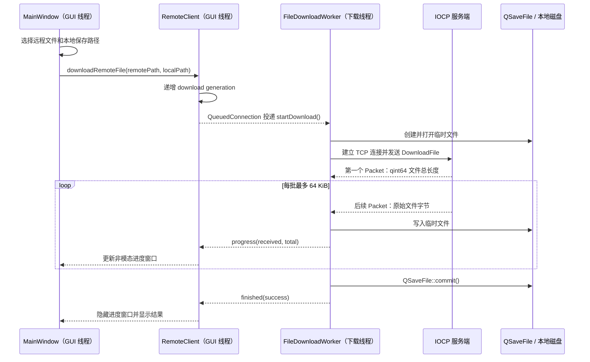

# 项目功能与技术实现

本文从“项目实现了什么”和“为什么这样实现”两个角度介绍 Remote Control Qt。它适合在阅读
具体函数之前建立整体认识；对象、线程和协议的完整细节分别参见
[客户端系统架构](ClientArchitecture.md)、[IOCP 服务端系统架构](ServerArchitecture.md)和
[远程控制协议参考](ProtocolReference.md)。跨模块的模式归类、不变量和工程取舍集中记录在
[设计思想与设计模式](DesignPrinciples.md)。

本项目是 Windows 平台上的 C++/Qt 学习项目，不是可直接暴露到公网的远程管理产品。它重点
练习 Qt 异步编程、TCP 自定义协议、客户端线程划分、Windows IOCP、任务池、状态机和资源安全。

## 阅读导航

- 想快速了解项目能力：阅读[功能概览](#功能概览)和[主要技术](#主要技术)。
- 想理解功能视角下的结构摘要：阅读[架构摘要](#架构摘要)。
- 想系统理解设计模式、不变量和取舍：阅读[设计思想与设计模式](DesignPrinciples.md)。
- 想重点理解下载：直接阅读[下载功能详解](#下载功能详解)。
- 想从文档进入代码：使用[推荐源码入口](#推荐源码入口)。

## 功能概览

| 功能 | 用户侧行为 | 主要实现 |
| --- | --- | --- |
| 连接测试 | 验证指定 host 和 port 上的服务端是否可用 | `TestConnection` 一次性异步 TCP 请求，15 秒无活动超时 |
| 远程磁盘与目录浏览 | 展开磁盘和目录，查看子目录及文件 | 懒加载、目录缓存、`DirectoryLoadState` 状态机、服务端分批枚举 |
| 打开远程文件 | 使用服务端 Windows 默认关联程序打开文件 | `RunFile` 短连接、shell-command 任务池、`ShellExecuteW` |
| 下载远程文件 | 选择本地路径、显示进度并保持其他界面操作可用 | 独立 `QThread`、流式传输、`QSaveFile`、代次过滤和超时处理 |
| 删除远程路径 | 删除远程文件或递归删除目录，成功后刷新当前目录 | file 任务池、状态响应和目录强制刷新 |
| 远程屏幕查看 | 在独立窗口中持续显示服务端主屏幕 | 屏幕长连接、单帧在途、约 30 FPS 上限、GDI 截图和 PNG 编解码 |
| 远程鼠标控制 | 移动、单击、按下、释放和双击远程鼠标 | 控制长连接、坐标映射、移动节流、队列合并和 `SendInput` |
| 模拟锁定与解锁 | 显示全屏覆盖窗口并限制本机交互 | Qt GUI 线程、`ScreenLockService`、Windows 任务栏和光标区域管理 |
| 服务端本地管理 | 托盘查看状态、锁定、定时锁定测试、开机启动、提权重启和退出 | `QSystemTrayIcon`、`QSettings`、Windows 注册表和 UAC |
| 自动化验证 | 验证协议、客户端 worker、IOCP 生命周期、状态机和异常输入 | 独立测试程序、CTest、嵌入式 transport、真实 TCP 故障注入和 smoke test |

## 主要技术

| 类别 | 技术 | 在项目中的用途 |
| --- | --- | --- |
| 语言与界面 | C++17、Qt Widgets | 客户端主界面、远程屏幕窗口、服务端托盘和模拟锁定窗口 |
| Qt 异步机制 | signal/slot、事件循环、`QThread`、`QMetaObject::invokeMethod` | 跨线程投递任务和返回结果，不让 GUI 同步等待网络或文件操作 |
| 客户端网络 | `QTcpSocket` | 一次性短连接、下载连接、屏幕长连接和控制长连接 |
| 服务端网络 | Winsock、IOCP、`AcceptEx`、`OVERLAPPED` | 使用少量 completion worker 管理多条并发 TCP 连接 |
| 阻塞任务隔离 | 固定大小有界任务池 | 分离 shell、文件和截图工作，避免阻塞 IOCP completion worker |
| Windows 集成 | GDI、`SendInput`、`ClipCursor`、`ShellExecuteW`、UAC、注册表 | 截图、鼠标控制、模拟锁定、文件打开、提权和开机启动 |
| 构建与开发 | CMake、Ninja、MSVC、clangd、clang-format、clang-tidy | 兼容 VS Code 与 Qt Creator，并统一构建和代码检查入口 |

## 架构摘要

本节只从功能视角概括实现结构；模式归类、生命周期不变量和完整取舍统一参见
[设计思想与设计模式](DesignPrinciples.md)。

| 结构选择 | 项目中的做法 | 主要目的 | 深入阅读 |
| --- | --- | --- | --- |
| 连接按业务拆分 | 独立请求、下载、屏幕和控制采用不同连接模型 | 隔离不同业务的延迟和关闭范围 | [客户端系统架构](ClientArchitecture.md) |
| GUI 不同步等待 | 持续任务进入三个常驻 worker 线程；短请求使用异步 socket | 保持窗口事件循环响应 | [Worker Object 与 Reactor](DesignPrinciples.md#worker-object让持续任务拥有明确线程归属) |
| 显式生命周期 | enum 和单向状态机代替互相关联的布尔组合 | 排除非法状态并明确终态 | [显式有限状态机](DesignPrinciples.md#显式有限状态机限制合法转换) |
| 旧结果隔离 | generation 判断回调是否仍属于当前 endpoint 或会话 | 防止旧结果污染新界面 | [Generation Token](DesignPrinciples.md#generation-token丢弃过期异步结果) |
| 有界生产 | 单帧在途、有界队列、分批发送和完成后续传 | 控制内存、延迟与慢消费者影响 | [Backpressure](DesignPrinciples.md#backpressure让生产速度服从消费能力) |

连接拆分的目的不是单纯增加连接数量。例如，大尺寸 PNG 或慢速下载不会占用鼠标控制通道，
控制命令也不会插入文件数据流。generation 只判断结果是否仍然有效，不会撤销服务端已经完成的
删除、打开等副作用。

## 功能实现

### 连接测试与 endpoint 管理

客户端从界面读取 host 和 port，`RemoteClient::testConnection()` 创建 `OneShotRequest`，连接后发送
空 payload 的 `TestConnection` Packet。服务端返回同命令响应并在发送结束后关闭连接。连接、响应
或网络活动超过 15 秒时，客户端通过单次定时器结束请求并报告失败。

host 或 port 改变后，客户端会使当前 endpoint generation 失效，同时停止旧的屏幕流和控制流，
并取消仍在进行的下载。界面要求重新执行连接测试后才重新启用远程浏览操作。

### 远程磁盘和目录浏览

`ListDrives` 返回服务端支持的本地盘符。客户端为每个磁盘创建一个树节点，并放入一个折叠状态下
的 `Loading...` 占位子节点，使 Qt 在尚未加载目录时仍显示可展开箭头。

目录节点把以下业务数据保存在 `QTreeWidgetItem` 的自定义 role 中：

- 规范化的远程完整路径；
- 当前 `DirectoryLoadState`；
- 成功加载的 `QList<FileEntry>` 缓存。

普通点击已加载目录时直接复用缓存，不再请求服务端；删除成功后才会对当前目录执行强制刷新。
首次加载失败会从 `Loading` 恢复到 `Unloaded`，刷新失败则从 `Refreshing` 恢复到 `Loaded`，因此
旧缓存不会因为一次网络错误被清空。缓存没有 TTL，也没有独立的目录刷新入口；服务端目录被其他
程序修改后，客户端可能继续显示旧内容，直到触发强制刷新或重新加载磁盘树。

服务端使用 `QDirIterator` 增量枚举，每批最多处理 64 个条目。只有当前批次发送完成后，才把下一批
工作重新投递到文件任务池，从而避免一次性构造大型目录响应或让文件 worker 等待网络。

### 打开和删除远程路径

打开文件使用 `RunFile` 短连接。IOCP completion worker 只负责识别命令，实际的路径检查和
`ShellExecuteW` 调用交给 shell-command 任务池。这样即使 Windows shell 响应较慢，也不会阻塞
其他连接的完成通知。成功响应只表示 Windows shell 接受了打开请求，不表示关联程序已经执行结束。

删除使用 `DeleteFile` 短连接，在文件任务池中删除普通文件或递归删除目录。客户端收到成功结果后
强制刷新当前目录。界面会阻止删除当前正在下载的同一路径，但服务端目前没有跨客户端的路径级锁；
不同客户端同时下载、运行或删除同一路径时，最终结果仍取决于 Windows 文件系统和命令执行顺序。

文件相关命令只接受直接位于本地 Windows drive 的路径，拒绝直接 UNC 路径和映射网络盘。当前未
验证 junction 或 symbolic link 解析后的最终位置，因此该检查不能作为安全沙箱。

### 下载功能详解

下载功能同时处理网络流、文件一致性、进度显示、取消、过期回调和线程关闭，是客户端异步设计中
最完整的一条调用链。

#### 正常下载流程

1. `MainWindow` 使用 `QFileDialog` 选择本地目标，记录当前下载路径，并显示非模态
   `QProgressDialog`。下载期间不能启动第二个下载，也不能修改 endpoint 或删除当前下载路径；其他
   不冲突的 GUI 操作仍可处理。
2. `RemoteClient` 递增 download generation，再用 `QMetaObject::invokeMethod(...,
   Qt::QueuedConnection)` 把启动任务投递给下载线程。调用立即返回，GUI 不等待下载结束。
3. `FileDownloadWorker` 在下载线程中创建 `QSaveFile`、`QTcpSocket` 和协议状态。该 worker 同一时间
   只接受一个下载。
4. 服务端先发送一个 little-endian `qint64` 文件长度。负数表示文件无法读取，零表示空文件；后续
   Packet 才携带原始文件数据。
5. 服务端每次最多读取 64 KiB，而且一批发送完成后才读取下一批。客户端不需要把完整文件放入内存，
   只保存尚未形成完整 Packet 的网络缓冲区。
6. 客户端累计已写字节数并发出进度 signal。界面将 `received / total` 换算到 0～100，并使用
   `qBound()` 限制显示范围。
7. 只有累计字节数精确等于服务端声明长度时，客户端才调用 `QSaveFile::commit()`，把临时文件提交为
   最终目标文件。

#### 为什么使用 `QSaveFile`

`QSaveFile` 不直接覆盖最终文件，而是先写临时内容。下载完整且 `commit()` 成功后才替换目标；
超时、断线、协议错误、写入失败、取消或进程关闭时调用 `cancelWriting()` 或销毁未提交对象，临时
内容会被放弃。这样不会把半个下载文件伪装成完整结果，也尽量保留目标路径上原有的有效文件。

#### 取消下载和旧结果隔离

协议没有单独的“取消下载”命令。endpoint 变化触发可报告结果的取消时，下载线程会：

1. 停止超时定时器；
2. 放弃 `QSaveFile` 临时内容；
3. 对下载 socket 调用 `abort()`；
4. 发出本地失败/取消结果。

TCP 断开后，服务端从 IOCP 完成通知中关闭该连接，后续文件分块不再继续发送。因此无需修改线上
Packet 格式，也无需等待服务端确认取消。

endpoint generation 表示结果属于哪一组 host/port，download generation 表示结果属于哪一次
下载或取消。进度和完成 signal 必须同时匹配这两个值才会到达界面。例如旧下载已经排队的进度、
旧取消结果和新下载结果即使交错返回，也只有当前下载能修改当前进度窗口。

当前 GUI 没有单独的手动取消按钮，且下载期间会禁用 endpoint 输入；现有取消路径主要保护
程序化 endpoint 变更和测试场景。对象析构时走另一条静默 `shutdown()` 路径：它同样放弃临时文件
并中止 socket，但不会发出 `finished`，因为 GUI 已经进入销毁流程。若以后增加取消按钮，可以继续
使用本地取消机制，而不必增加协议命令。

#### 下载异常检查

下载 worker 会统一处理以下情况，并确保一次下载只报告一次最终结果：

- endpoint 或路径为空；
- 本地临时文件无法打开、写入不完整或提交失败；
- 连接失败、socket 错误、意外断开或 15 秒无网络活动；
- 第一个 Packet 不是固定大小的 `qint64`；
- 服务端返回负文件长度或错误命令；
- 收到的数据超过服务端声明的文件长度；
- 协议缓冲区超过允许的 Packet 大小。

当前下载没有断点续传、暂停、自动重试、文件哈希或远程文件快照锁。如果服务端文件在下载过程中
被其他程序修改，项目不能保证得到某一时刻的完整快照。

### 远程屏幕查看

`RemoteScreenWindow` 显示后立即请求第一帧。每一帧完成后，它根据从请求提交起经过的时间，只等待
33 ms 周期中剩余的部分，再请求下一帧。因此帧率上限约为 30 FPS；网络、截图或解码较慢时不会
积压定时请求。

客户端 GUI 的 `m_screenFramePending` 和 `ScreenStreamWorker` 状态共同保证单帧在途。worker 在独立
线程维护持久 `QTcpSocket`，验证响应命令后把 PNG 解码为 `QImage`。关闭监控窗口会停止屏幕和控制
长连接，generation 会阻止已经排队的旧帧重新显示。

服务端把截图与 PNG 编码交给截图任务池。每个截图 worker 复用线程局部的 GDI memory DC 和 DIB，
减少反复创建原生资源；16 ms 内来自不同监控连接的请求可以共享已序列化帧，但同一连接不会连续
复用自己的上一帧。

### 鼠标控制

`RemoteScreenWidget` 将窗口中的鼠标坐标按当前图像尺寸映射为远程屏幕绝对坐标。高频移动事件由
16 ms 单次定时器合并，只保留待发送的最新位置。按下、释放或双击等离散事件发出前会先
刷新待发送移动，保持 GUI 事件的相对顺序；关闭监控窗口时会直接清除未发送移动，避免它随后重新
建立已经停止的控制连接。

`ControlStreamWorker` 建立独立控制长连接，先发送 `ControlChannel` 握手。握手成功后使用有序队列，
同一时间只让一个命令等待响应。队列中相邻的纯移动命令可以继续合并，但不会跨越按键事件、锁定
或解锁命令；队列最多保存 128 个命令。

服务端验证固定大小的 `MouseEventPacket`，再通过 `WindowsPlatformIntegration` 调用 `SetCursorPos`
和 `SendInput`。进程级 mutex 保证来自不同控制连接的一次“定位加输入注入”不会从中间交错，但
多个客户端仍可能轮流改变鼠标位置；项目目前没有独占控制权或控制租约。

### 模拟锁定、解锁和定时测试

远程锁定和解锁通过控制长连接发送。IOCP 线程不能直接操作 Qt widget，因此
`WindowsRemoteControlHostServices` 使用 `Qt::QueuedConnection` 把请求投递到
`ScreenLockService` 所属 GUI 线程。此时的成功状态只表示投递已被接受，不表示锁定窗口已经完成
状态切换；当前协议没有为实际 GUI 执行结果发送第二次确认。

锁定后，服务端显示全屏覆盖窗口、隐藏任务栏、限制光标区域并抢占键盘输入；解锁时恢复此前保存
的任务栏可见性和光标限制。`ScreenLockService::runTimedLockTest()` 使用 GUI 线程定时器在指定秒数
后执行解锁，服务端不会因为测试结束而退出。`Ctrl+C` 提供本地紧急恢复入口。

这只是应用级模拟锁定，不等同于 Windows 会话锁定，也不能作为安全边界。

### 服务端托盘与 Windows 辅助功能

服务端托盘提供监听端口状态、管理员权限状态、启用/禁用当前用户开机启动、锁定、解锁、定时锁定
测试和退出操作。

- 开机启动通过 `QSettings::NativeFormat` 写入或删除当前用户注册表启动项。
- 提权重启通过 `ShellExecuteW` 的 `runas` verb 触发 Windows UAC，并保留原服务端参数。
- 新的提权进程可以等待旧进程退出后再绑定相同端口，避免两个进程竞争监听 socket。
- `--install-startup` 和 `--remove-startup` 只修改启动项后退出，不启动网络服务。

## 服务端并发与资源管理

服务端使用一组 IOCP completion worker 处理所有 accept、receive 和 send 完成通知，并使用三类固定
任务池执行可能阻塞的 shell、文件和截图工作。每条活动连接最多只有一个 `WSARecv` 和一个
`WSASend` 在途。

`ConnectionContext` 使用不同 mutex 分别保护 socket 提交/关闭、发送队列、文件续传和屏幕帧流控；
`IoOperation` 持有连接的 `shared_ptr`，保证内核完成通知返回前上下文仍有效；连接状态机保证只有
一个线程能够赢得关闭转换并执行资源移除。停机时先禁止新工作、关闭连接并取消 I/O，再停止任务池，
最后排空 completion 通知并 join 线程。

这些机制解决的是内存、生命周期和 I/O 状态的线程安全。服务端目前没有按文件路径协调不同客户端
的业务命令，也没有远程控制权仲裁，因此“下载与删除同一路径”或“多个客户端同时控制鼠标”仍会
产生由执行顺序决定的业务冲突。

## 协议与错误恢复

项目使用自定义 little-endian TCP Packet，包含固定头、长度、命令、payload 和累加校验值。
`Packet::tryParse()` 支持半包、粘包，并能从非法头、长度和校验值中重新寻找同步点。首个完整 Packet
决定服务端连接角色，分类后不能切换为其他业务类型。

校验值只用于发现传输或解析错误，不提供密码学完整性。当前协议没有 TLS、身份认证、授权、重放
保护或完整版本协商，因此只能在学习、测试或明确授权的受控网络中使用。

## 测试覆盖

协议、客户端 worker、连接状态机和 IOCP transport 的无系统副作用测试由 CTest 统一运行。其中
transport 生命周期测试会连续创建并启停多个独立 transport 实例，并不表示同一个已经 `stop()`
的实例可以重新启动。`RemoteControlSmokeTests` 会操作运行中的服务端，包括截图、鼠标和文件功能，
只应在受控测试环境中执行。完整 target 和覆盖范围统一参见项目 [README](../README.md#测试)，建议
阅读顺序参见[项目代码学习指南](StudyGuide.md#阶段七用测试验证理解)。

## 推荐源码入口

| 想理解的内容 | 入口文件 |
| --- | --- |
| 主界面、目录缓存和下载进度 | [MainWindow.cpp](../src/client/MainWindow.cpp) |
| 客户端 facade、generation 和线程关闭 | [RemoteClient.cpp](../src/client/RemoteClient.cpp) |
| 下载协议、临时文件和失败处理 | [FileDownloadWorker.cpp](../src/client/FileDownloadWorker.cpp) |
| 监控帧连接 | [ScreenStreamWorker.cpp](../src/client/ScreenStreamWorker.cpp) |
| 控制握手、队列和移动合并 | [ControlStreamWorker.cpp](../src/client/ControlStreamWorker.cpp) |
| 屏幕调度和鼠标坐标映射 | [RemoteScreenWindow.cpp](../src/client/RemoteScreenWindow.cpp)、[RemoteScreenWidget.cpp](../src/client/RemoteScreenWidget.cpp) |
| 协议定义与 Packet | [Protocol.h](../include/common/Protocol.h)、[Packet.cpp](../src/common/Packet.cpp) |
| IOCP 启停、收发和安全关闭 | [RemoteControlTransport.cpp](../server_transport/src/RemoteControlTransport.cpp) |
| 服务端命令路由和屏幕流 | [RemoteControlTransportProtocol.cpp](../server_transport/src/RemoteControlTransportProtocol.cpp) |
| 服务端目录、下载和删除 | [RemoteControlTransportFileTransfer.cpp](../server_transport/src/RemoteControlTransportFileTransfer.cpp) |
| Windows 截图、输入、路径、提权和启动项 | [WindowsPlatformIntegration.cpp](../src/server/WindowsPlatformIntegration.cpp) |
