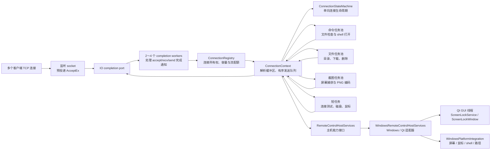

# IOCP 服务端系统架构

本文说明服务端引入 Windows I/O Completion Ports（IOCP）后的组件职责、线程模型、连接状态
和关闭顺序。构建与命令行参数参见项目 [README](../README.md)，共享协议参见
[远程控制协议参考](ProtocolReference.md)。

第一次阅读不需要同时理解托盘、UAC、启动项和 GDI 细节。先跟踪一条 `TestConnection` 请求，
再理解连接状态、发送队列和停机顺序；外围 Windows 集成功能可以最后阅读。

## 总体架构



服务端仍然只有一个可执行程序 `RemoteControlServer`。独立静态库 target
`RemoteControl::ServerTransport` 复用 IOCP 传输代码供服务端和测试调用，并不是第二个服务端。
`RemoteControlServer` 负责 Qt 应用生命周期和 `ScreenLockService`；
`WindowsRemoteControlHostServices` 把 Windows/Qt 主机能力注入传输层；`RemoteControlTransport` 的
PIMPL 隐藏 Windows socket、`OVERLAPPED` 和完成端口类型，因此应用层头文件不会暴露 Windows 网络细节。

IOCP 实现按变化原因拆成多个逻辑组件，仍共同服务于同一个 `RemoteControlTransport::Impl`，不会增加额外的网络层级：

| 文件 | 职责 |
| --- | --- |
| `RemoteControlTransport.cpp` | 启停、AcceptEx、收发完成通知、连接关闭和有序发送队列 |
| `RemoteControlTransportProtocol.cpp` | 首包路由、控制流、屏幕流和打开文件命令 |
| `RemoteControlTransportFileTransfer.cpp` | 目录枚举、文件下载和删除 |
| `RemoteControlTransportRuntime.cpp` | Winsock 生命周期、固定任务池、连接状态机和连接注册表 |
| `RemoteControlTransportLog.cpp` | 统一输出带事件名、连接标识、线程标识和时间戳的结构化 JSON 日志 |

`RemoteControlTransportImpl.h` 位于 target 的 `internal` 目录，只共享上述实现文件和白盒状态机测试
所需的内部类型；普通调用方只包含 `RemoteControlTransport.h` 和
`RemoteControlHostServices.h`。`src` 目录因此只保留 `.cpp` 实现文件。

`RemoteControlTransportOptions` 集中保存 completion worker、任务池、连接容量和各阶段空闲超时。
服务端使用默认值；压力测试可以注入较小限制，以稳定复现容量、超时和停机边界。

阅读实现时应持续检查以下三个不变量：

1. 每条活动连接最多只有一个 `WSARecv` 和一个 `WSASend` 在途。
2. 每个成功投递的 `OVERLAPPED` 操作都增加 pending 计数，每个完成通知恰好减少一次。
3. 只有赢得 `Closing` 状态转换的线程负责移除注册表条目并关闭 socket。

## 线程划分

| 执行位置 | 主要职责 | 不应执行的工作 |
| --- | --- | --- |
| Qt GUI 线程 | 托盘、`ScreenLockWindow`、模拟锁定计时器 | 网络等待、大文件读写、截图编码 |
| IOCP completion workers | 消费完成通知、解析 Packet、推进连接状态、投递下一次 I/O | 长时间阻塞操作 |
| 命令任务池 | 文件存在性检查和 shell 打开操作 | 网络状态机和 GUI 操作 |
| 文件任务池 | 目录枚举、删除、分块读取下载文件 | 直接操作 Qt GUI 对象 |
| 截图任务池 | 捕获屏幕并编码 PNG | 直接等待网络发送完成 |
| 超时监控线程 | 检查连接最后活动时间并关闭过期连接 | 协议处理和文件操作 |

completion worker 数量根据硬件并发度限制在 2～4 个；它们由所有连接共享，不会因为新连接
频繁创建和销毁线程。命令池固定为 2 个 worker，文件池固定为 4 个 worker，截图池固定为
2 个 worker，避免 shell、慢磁盘或 PNG 编码占满 IOCP worker。

## 一条连接的 I/O 流程

```text
1. start() 创建监听 socket、完成端口和 worker，并预投递多个 AcceptEx。
2. accept 完成后，把新 socket 关联到同一个完成端口并投递第一次 WSARecv。
3. recv 完成后，将字节追加到连接缓冲区，循环调用 Packet::tryParse() 处理拆包和粘包。
4. 根据第一个命令把连接从 `AwaitingRequest` 分类为 `OneShot`、`FileTransfer`、`ScreenStream` 或 `ControlStream`。
5. 确定不会阻塞的短任务直接产生响应；其余任务投递到对应任务池，完成后进入发送队列。
6. 每条连接最多有一个 WSASend 在途；部分发送完成后继续发送剩余字节。
7. 文件批次发送完后，再把下一批目录编码或文件读取投递回文件池；任务线程不等待网络。
8. 一次性请求在最后一个响应发送完成后关闭，长连接重新投递 WSARecv。
```

`IoOperation` 继承 `OVERLAPPED`，同时记录操作类型、缓冲区和连接的 `shared_ptr`。因此内核仍可能
返回完成通知时，连接上下文不会被提前释放。`ConnectionContext` 使用不同互斥量分别保护 socket
提交/关闭、文件续传状态、监控流控状态和发送队列。`ConnectionStateMachine` 使用单个原子阶段
约束生命周期；`ConnectionRegistry` 统一持有活动连接，并在分类和移除时原子地预留或释放长连接配额。

允许的主状态转换为：

```text
AwaitingRequest ──► OneShot / FileTransfer / ScreenStream / ControlStream
       │                              │
       └──────────────────────────────┴──► Closing ──► Closed
```

连接只能分类一次，不能在不同业务角色之间切换；任何活动阶段都可以因完成、断开、超时、协议错误、
容量限制或服务端关闭进入 `Closing`。只有赢得 `Closing` 转换的线程执行 socket 取消和注册表移除，
从而让并发的 I/O 完成通知、超时线程和停机线程不会重复清理同一连接。

## 连接角色与任务路由

| 角色 | 命令 | 生命周期 |
| --- | --- | --- |
| `OneShot` | `TestConnection`、`ListDrives`、`RunFile` | 返回一个状态或磁盘列表后关闭 |
| `FileTransfer` | `ListDirectory`、`DownloadFile`、`DeleteFile` | 返回目录序列、文件长度与数据或状态后关闭 |
| `ScreenStream` | `WatchScreen` | 持久连接；一帧在途，并可合并一个提前到达的下一帧请求 |
| `ControlStream` | `ControlChannel` 握手、鼠标、模拟锁定和解锁 | 持久连接；命令按到达顺序响应 |

服务端总连接数最多为 256，监控与控制各限制为最多 4 条连接。每条发送队列具有 2 MiB
积压上限和 16 MiB 单次发送硬上限。目录通过 `QDirIterator` 增量枚举，每批最多编码 64 个条目；
客户端收到终止标记后再按目录优先和名称排序。下载每批最多读取 64 KiB；一批发送完成后才向
文件池投递下一批。任何任务 worker 都不会等待发送队列腾出空间，积压超限时会关闭对应连接。
所有模式按最近一次接收或发送进度检查空闲超时，避免慢客户端永久占用连接、任务线程或内存。

## 结构化诊断日志

transport 通过 Qt logging category `remote_control.server.transport` 输出单行紧凑 JSON。公共字段包括
`event`、`timestamp_utc` 和 `thread_id`；连接事件还会携带 `connection_id`、`phase`、
`reason` 和 `active_connections` 等字段。当前关键事件包括服务端启动/停止、连接接受、首包分类、
发送背压以及连接关闭。这样可以按事件名或连接标识关联同一条连接跨线程发生的日志，而不需要
解析不稳定的自然语言文本。

日志仍使用 Qt 自带的 `QLoggingCategory`、`QJsonDocument` 和消息处理机制，没有引入额外依赖。
需要调整详细程度时可使用 `QT_LOGGING_RULES`，例如：

```powershell
$env:QT_LOGGING_RULES = "remote_control.server.transport.debug=false"
```

## Qt 与 IOCP 的边界

IOCP 只替换服务端网络传输层，不改变协议，也不要求客户端改用 Windows API。客户端继续使用
`QTcpSocket`，Qt Creator 和 VS Code 仍然构建同一个 CMake target。

IOCP target 只依赖 `RemoteControlHostServices`，不直接包含 `ScreenLockService` 或
`WindowsPlatformIntegration`。服务端中的 `WindowsRemoteControlHostServices` 负责把磁盘枚举、路径检查、
鼠标注入、屏幕捕获、文件打开和锁屏请求转接到 Windows/Qt 实现。文件打开会先投递到
shell-command 任务池；模拟锁定和解锁需要操作 `ScreenLockWindow`，所以适配器使用
`QMetaObject::invokeMethod(..., Qt::QueuedConnection)` 把操作投递给 `ScreenLockService` 所属的
GUI 线程。本地恢复快捷键也通过 `ScreenLockWindow::unlockRequested()` 回到 `ScreenLockService`，保证
测试计时器和锁定状态同步。模拟锁定会保存原有任务栏可见性和 cursor clip 区域，解锁时按原值
恢复，不会假设系统原来处于默认状态。文件浏览、下载、删除和执行会拒绝直接的 UNC 路径与映射网络盘；
当前尚未解析并验证 junction 或 symbolic link 的最终目标，因此这层检查不是安全沙箱。屏幕捕获按截图
worker 复用 GDI DIB 和 memory DC，并在 DIB 有效期内
直接编码 PNG，不再复制完整像素图；16 ms 内到达的不同连接请求共享已经序列化的完整响应包。
每条监控连接记录上一帧标识，不会连续复用自己的缓存帧。这样可降低多监控连接的重复分配、
截图、复制、编码和序列化开销。托盘提权重启会保留当前参数，并让新进程等待旧
进程退出后再绑定相同端口。

## 安全关闭顺序

```text
RemoteControlServer::shutdownTransport()
  → RemoteControlTransport::stop() 禁止接收新任务
  → 关闭监听 socket 和活动连接，取消待完成 I/O
  → 请求取消任务线程中的同步 I/O，再停止命令池、文件池、截图池和超时监控线程
  → completion workers 继续排空取消/完成通知
  → 待投递 I/O 计数归零后发送 worker 退出通知
  → 如果退出通知投递失败，则关闭完成端口唤醒其余 worker
  → join 所有线程并关闭 IOCP、socket 和 Winsock
```

不能先销毁完成端口或连接上下文再等待完成通知，否则内核可能向已经失效的 `OVERLAPPED` 或
连接对象写入结果。当前实现通过待完成 I/O 计数、`shared_ptr` 和单向连接状态机保证上述顺序。

## 自动化验证

| 测试 | 重点验证 |
| --- | --- |
| `RemoteControlProtocolTests` | Packet 编解码、损坏输入恢复和协议边界 |
| `RemoteControlTransportLifecycleTests` | 连续创建 40 个 transport 实例，在连接到达时停止并验证 pending I/O 和线程回收 |
| `RemoteControlConnectionStateTests` | 合法/非法状态转换、并发关闭唯一获胜者、总连接和长连接配额释放 |
| `RemoteControlTransportResilienceTests` | 损坏前缀、错误校验、超长声明、半包断开、角色错配，以及 128 次并发真实 TCP 请求 |

上述测试直接启动嵌入式 `RemoteControlTransport` 并使用临时端口，不需要人工启动服务端，也不会执行
鼠标、锁定、删除或文件运行等系统副作用。`RemoteControlSmokeTests` 仍用于单独验证完整端到端业务。

## 深入阅读顺序

第一次学习整个项目时，先按 [项目代码学习指南](StudyGuide.md) 建立客户端、协议和服务端边界，
再使用下面的顺序深入 IOCP 实现。

1. [RemoteControlServer.h](../include/server/RemoteControlServer.h) 和
   [RemoteControlServer.cpp](../src/server/RemoteControlServer.cpp)：理解 Qt 适配层。
2. [RemoteControlHostServices.h](../server_transport/include/RemoteControlHostServices.h)：
   理解传输层需要哪些主机能力。
3. [RemoteControlTransport.h](../server_transport/include/RemoteControlTransport.h)：
   理解公开边界和 PIMPL。
4. [RemoteControlTransportImpl.h](../server_transport/internal/RemoteControlTransportImpl.h)：先看
   `ConnectionPhase`、`ConnectionStateMachine`、`ConnectionContext`、`ConnectionRegistry` 和 `IoOperation`，
   其余 `Impl` 私有函数声明可暂时跳过。
5. [RemoteControlTransport.cpp](../server_transport/src/RemoteControlTransport.cpp)：依次跟踪 `start()`、`postAccept()`、
   `runCompletionWorker()`、`handleReceiveCompletion()` 和 `handleSendCompletion()`。
6. [RemoteControlTransportProtocol.cpp](../server_transport/src/RemoteControlTransportProtocol.cpp)：跟踪首包如何路由到短请求、
   `ScreenStream` 和 `ControlStream` 长连接。
7. [RemoteControlTransportFileTransfer.cpp](../server_transport/src/RemoteControlTransportFileTransfer.cpp)：
   理解目录与下载如何按发送完成节奏分批推进。
8. [RemoteControlTransportRuntime.cpp](../server_transport/src/RemoteControlTransportRuntime.cpp)：
   理解 Winsock RAII、固定任务池、状态机和注册表实现。
9. 最后回到 `RemoteControlTransport.cpp` 阅读 `stop()`，核对取消 I/O、排空 completion 和线程回收顺序。

以已经具备 C++/Qt 基础并读完客户端为前提，理解主要服务端调用链通常需要 15～25 小时；能够
解释 IOCP 对象生命周期、并发关闭和安全停机约需 25～40 小时。托盘、UAC、注册表和 GDI 可以
放在核心网络流程之后单独学习。
