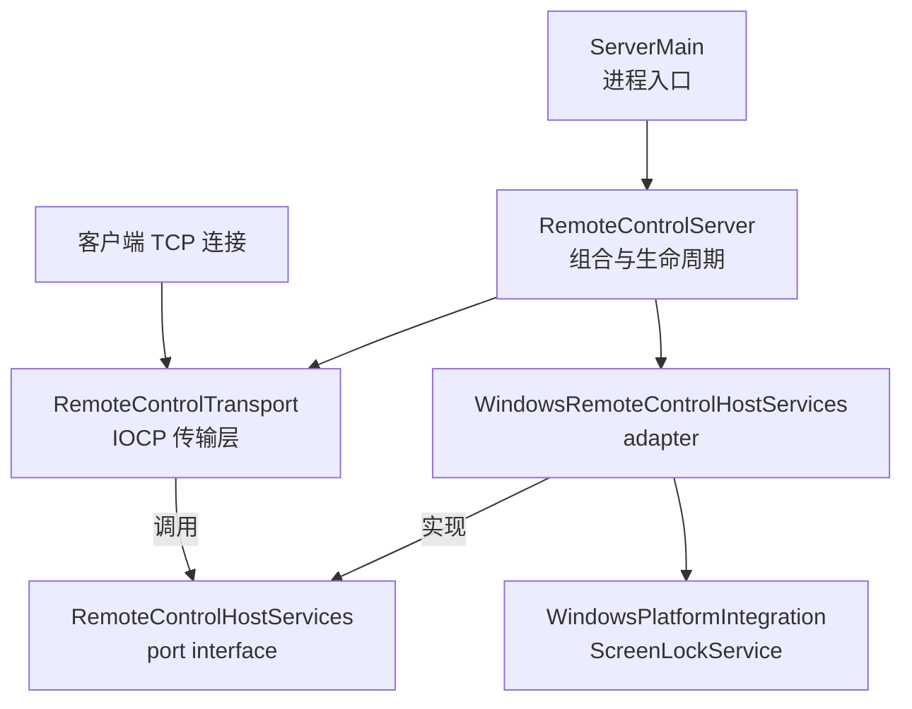

# IOCP 服务端系统架构

本文说明 Remote Control Qt 服务端采用 Windows I/O Completion Ports（IOCP）后的项目组件职责、
线程模型、连接状态和关闭顺序；它是项目架构文档，不是 IOCP 入门教程。`OVERLAPPED`、
`WSA_IO_PENDING`、completion port、取消完成等基础知识统一参见外部
[IOCP 学习路线](https://github.com/slimesq/IOCP/blob/main/docs/IOCP%E5%AD%A6%E4%B9%A0%E8%B7%AF%E7%BA%BF.md)。
构建与命令行参数参见项目 [README](../README.md)，共享协议参见
[远程控制协议参考](ProtocolReference.md)。跨组件的设计模式、生命周期原则和工程取舍参见
[设计思想与设计模式](DesignPrinciples.md)。本项目源码与测试是行为事实来源，本文是同步维护的架构说明；
外部仓库负责基础概念和练习。

本文区分三个不同范围的“关闭”：

- **连接关闭**：结束一个 `ConnectionContext` 对应的 socket 和业务角色；其他连接与 transport 继续运行。
- **transport（IOCP）停机**：`RemoteControlTransport::stop()` 停止监听、关闭全部连接、排空已投递 I/O、
  回收任务池与 IOCP worker，最后释放 completion port。
- **服务端进程退出**：`QApplication` 事件循环结束，栈上的 `RemoteControlServer` 随后析构。
  transport 停机只是其中的网络子系统步骤；进程退出还包括托盘、模拟锁定窗口和
  其他 Qt 应用层资源的回收。

第一次阅读不需要同时理解托盘、UAC、当前用户登录启动项和 GDI 细节。先跟踪一条
`TestConnection` 请求，
再理解连接状态、发送队列和停机顺序；外围 Windows 集成功能可以最后阅读。

## 总体架构



服务端仍然只有一个可执行程序 `RemoteControlServer`。独立静态库 target
`RemoteControl::ServerTransport` 复用 IOCP 传输代码供服务端和测试调用，并不是第二个服务端。
`ServerMain.cpp` 中的 `main()` 负责 `QApplication`、命令行与一次性维护操作，然后创建
`RemoteControlServer`、启动监听、按需创建托盘，最后进入 Qt 事件循环。
`RemoteControlServer` 类本身是组合与关闭边界：它持有 `ScreenLockService`、
`WindowsRemoteControlHostServices` 和 `RemoteControlTransport`，并在 `aboutToQuit` 或析构时停止
transport；它不负责解析命令行或创建托盘。

`RemoteControlHostServices` 是 transport 调用的 port interface，
`WindowsRemoteControlHostServices` 是该接口的 Windows/Qt adapter，依赖方向是 adapter 实现
port，而不是 port 依赖 adapter。adapter 再把主机能力转接到
`WindowsPlatformIntegration` 和 `ScreenLockService`。`RemoteControlTransport` 的 PIMPL 隐藏
Windows socket、`OVERLAPPED` 和 completion port 类型，因此应用层头文件不会暴露
Windows 网络细节。

IOCP 实现按运行时、协议、文件传输和日志等变化原因拆分，但这些文件仍共同服务于同一个
`RemoteControlTransport::Impl`，不会增加额外的网络层级。具体入口统一列在本文末尾的
[源码索引](#源码索引)。`RemoteControlTransportImpl.h` 位于 target 的 `internal` 目录，只共享实现文件和
白盒状态机测试所需的内部类型；普通调用方只包含 `RemoteControlTransport.h` 和
`RemoteControlHostServices.h`，`src` 目录因此只保留 `.cpp` 实现文件。

`RemoteControlTransportOptions` 集中保存 completion worker 上下限、初始 accept 数、三个任务池的
worker/队列容量、连接配额和各阶段空闲超时。生产服务端使用默认配置；测试可以注入较小限制，
以稳定复现容量、超时和停机边界。当前默认值集中列在
[默认运行参数与背压](#默认运行参数与背压)；它们均可由 options 调整，不是分散在业务代码中的硬编码限制。

阅读实现时应持续检查以下三个不变量：

1. 每条活动连接最多只有一个 `WSARecv` 和一个 `WSASend` 在途。
2. 每个成功投递的 `OVERLAPPED` 操作都对应一个 pending 登记，最终 completion 被 worker 消费时
   恰好回收一次。
3. 只有赢得 `Closing` 状态转换的线程负责移除注册表条目并关闭 socket。

`m_pendingIoOperationCount` 的稳定语义是“已经投递、但最终 completion 尚未被 worker 消费的 I/O”。
实现必须在调用异步 API 前先登记，以防 completion 抢先返回；若 API 同步拒绝投递，则当前提交路径
立即回滚该登记。因此它不是活动连接数、任务池工作数，也不是仍在执行 completion handler 的线程数。

## 线程划分

- **Qt GUI 线程**
  - 负责托盘、`ScreenLockWindow` 和模拟锁定计时器。
  - 不执行网络等待、大文件读写或截图编码。
- **IOCP completion workers**
  - 负责消费完成通知、解析 Packet、推进连接状态并投递下一次 I/O。
  - accept completion 会先补齐 `AcceptEx` 槽位，再把新 socket 关联到 completion port。
  - 不执行长时间阻塞操作。
- **命令任务池**
  - 负责文件存在性检查和 shell 打开操作。
  - 不推进网络状态机，也不操作 GUI。
- **文件任务池**
  - 负责目录枚举、删除和分块读取下载文件。
  - 不直接操作 Qt GUI 对象。
- **截图任务池**
  - 负责捕获屏幕并编码 PNG。
  - 不直接等待网络发送完成。
- **超时与 accept 补充线程**
  - 每秒检查连接最后活动时间并关闭过期连接。
  - 定期重试补齐因短暂投递失败而缺失的 `AcceptEx` 槽位。
  - 它是一条兼任两项职责的 monitor thread，项目没有额外创建专用 accept thread。
  - 不处理协议或文件操作。

三个 `TaskPool` 是 `RemoteControlTransport::Impl` 的数据成员；它们在 `Impl` 构造过程中立即创建
固定数量的 worker，早于 `RemoteControlTransport::start()`。`start()` 才创建 completion port、
监听 socket、completion workers 和上述 monitor thread，然后预投递 `AcceptEx`。因此任务池不会
随每次连接或每个业务任务频繁创建与销毁；新连接也不会创建专属线程。

截图池可以同时承载多个连接的任务，但全局 `m_screenFrameCacheMutex` 覆盖缓存检查、GDI 截图、
PNG 编码和 Packet 序列化。因此两个截图 worker 不会同时执行 GDI 捕获；等待者会在前一帧完成后
优先复用有效的序列化缓存。这里默认配置的两个 worker 用于承载跨连接任务和衔接缓存复用，不代表
两次截图可以真正并行。

## 默认运行参数与背压

以下值对应生产服务端未显式传入 options 时的配置；测试可通过
`RemoteControlTransportOptions` 覆盖可配置项。

- **网络与线程**
  - 启动时保持 8 个待完成的 `AcceptEx` 操作。
  - completion worker 数量按硬件并发度取值，但始终限制在 2～4 个。
  - shell-command、文件和截图任务池分别使用 2、4、2 个 worker。
  - 三个任务池的待执行队列分别最多保存 16、64、8 个任务；队列满时拒绝新任务。
- **连接容量**
  - 总活动连接最多 256 条。
  - `ScreenStream` 和 `ControlStream` 各最多 4 条，并同时受总连接上限约束。
- **空闲超时**
  - monitor 以最近一次成功接收或发送进展为起点，避免慢客户端永久占用连接与内存。
  - 等待首个完整 Packet：15 秒。
  - `OneShot`、`FileTransfer` 和 `ScreenStream`：30 秒无收发进展。
  - `ControlStream`：5 分钟无收发进展。
- **发送与分批背压**
  - 每条连接最多只有一个 `WSASend` 在途；已存在发送时，后续积压上限为 2 MiB。
  - 单次排入的序列化数据最大为 16 MiB；超限或队列无容量时关闭对应连接，
    任务 worker 不等待队列腾出空间。
  - 目录每批最多编码 64 个条目；下载每批最多读取 64 KiB。当前批次发送完成后，
    才向文件任务池投递下一批。
  - 每条屏幕流一次只运行一个截图任务，并最多合并一个提前到达的下一帧请求；
    16 ms 内不同连接可复用已序列化帧。

## 一条连接的 I/O 流程

1. `RemoteControlTransport` 构造时，`Impl` 先启动三个固定大小任务池。`start()` 随后创建
   completion port、监听 socket、completion workers 和 monitor thread，再预投递 8 个 `AcceptEx`。
2. accept 完成后，completion worker 立即补齐一个 `AcceptEx` 槽位，再把新 socket 关联到
   同一个 completion port 并投递第一次 `WSARecv`。如果补充暂时失败，monitor thread 会定期重试。
3. recv 完成后，将字节追加到连接缓冲区，循环调用 `Packet::tryParse()` 处理拆包和粘包。
4. 根据第一个命令把连接从 `AwaitingRequest` 分类为 `OneShot`、`FileTransfer`、`ScreenStream` 或
   `ControlStream`。
5. 确定不会阻塞的短任务直接产生响应；其余任务投递到对应任务池，完成后进入发送队列。
6. 每条连接最多有一个 `WSASend` 在途；部分发送完成后继续发送剩余字节。
7. 文件批次发送完后，再把下一批目录编码或文件读取投递回文件池；任务线程不等待网络。
8. `OneShot` 和 `FileTransfer` 在最终响应发送完成后关闭；`ScreenStream` 和 `ControlStream` 每次处理完
   receive completion 后，只要连接仍有效就立即重新投递 `WSARecv`。接收与有序发送相互独立，
   可以各有一个操作在途。

`IoOperation` 继承 `OVERLAPPED`，同时记录操作类型、缓冲区和连接的 `shared_ptr`。因此内核仍可能
返回完成通知时，连接上下文不会被提前释放。`ConnectionContext` 使用不同互斥量分别保护 socket
提交/关闭、文件续传状态、监控流控状态和发送队列。`ConnectionStateMachine` 使用单个原子阶段
约束生命周期；`ConnectionRegistry` 统一持有活动连接，并在分类和移除时原子地预留或释放长连接配额。

允许的主状态转换为：

```text
AwaitingRequest ──► OneShot / FileTransfer / ScreenStream / ControlStream
       │                              │
       └──────────────────────────────┴──► Closing ──► Closed
```

连接只能分类一次，不能在不同业务角色之间切换；任何活动阶段都可以因完成、断开、超时、协议错误、
容量限制或 transport 停机进入 `Closing`。只有赢得 `Closing` 转换的线程执行 socket 取消和注册表移除，
从而让并发的 I/O 完成通知、超时线程和停机线程不会重复清理同一连接。

## 连接角色与任务路由

- **`OneShot`**
  - 命令：`TestConnection`、`ListDrives`、`RunFile`。
  - 生命周期：返回单个响应（空测试回包、磁盘列表或状态）后关闭。
- **`FileTransfer`**
  - 命令：`ListDirectory`、`DownloadFile`、`DeleteFile`。
  - 生命周期：返回目录序列、文件长度与数据或状态后关闭；客户端在收到目录终止标记后
    再按目录优先和名称排序。
- **`ScreenStream`**
  - 命令：`WatchScreen`。
  - 生命周期：保持连接，一次只处理一帧，并可合并一个提前到达的下一帧请求。
- **`ControlStream`**
  - 命令：`ControlChannel` 握手、鼠标、模拟锁定和解锁。
  - 生命周期：保持连接，按命令到达顺序响应。

## Qt 与 IOCP 的边界

IOCP 只替换服务端网络传输层，不改变协议，也不要求客户端改用 Windows API。客户端继续使用
`QTcpSocket`，Qt Creator 和 VS Code 仍然构建同一个 CMake target。

### Transport 与 host services

`RemoteControl::ServerTransport` target 公开链接 Qt Core 和共享协议 target，公开边界由
`RemoteControlTransport` 与 `RemoteControlHostServices` 组成；私有实现链接 Winsock/IOCP 系统库。
它不依赖 `ScreenLockService`、`ScreenLockWindow` 或 `WindowsPlatformIntegration` 等具体应用实现。
服务端注入的 `WindowsRemoteControlHostServices` 把磁盘枚举、路径检查、鼠标注入、屏幕捕获、
文件打开和锁屏请求转接到 Windows/Qt 实现。文件打开等可能阻塞的调用先进入对应有界任务池，
而不是在 completion worker 中执行。

### GUI 线程

模拟锁定和解锁需要操作 `ScreenLockWindow`，因此 `WindowsRemoteControlHostServices` 使用
`QMetaObject::invokeMethod(..., Qt::QueuedConnection)` 把请求投递给 `ScreenLockService` 所属 GUI 线程。
本地恢复快捷键也通过 `ScreenLockWindow::unlockRequested()` 回到该服务，保证测试计时器和锁定状态同步。
模拟锁定保存原有任务栏可见性和 cursor clip 区域，解锁时按原值恢复，不假设系统原来处于默认状态。

### Windows 外围能力

- **文件路径**：文件浏览、下载、删除和执行会拒绝直接的 UNC 路径与映射网络盘。当前尚未解析并
  验证 junction 或 symbolic link 的最终目标，因此这层检查不是安全沙箱。
- **截图缓存**：截图 worker 复用 GDI DIB 和 memory DC，并在 DIB 有效期内直接编码 PNG。16 ms 内
  到达的不同连接请求可共享已经序列化的完整响应包，而同一监控连接不会连续复用自己的上一帧。
- **UAC 提权重启**：托盘提权重启会保留当前参数，并让新进程等待旧进程退出后再绑定相同端口。

这些能力属于 Windows/Qt 应用外围，不改变 transport 的 IOCP 生命周期协议。

## 安全关闭顺序

1. `RemoteControlServer::shutdownTransport()` 调用 `RemoteControlTransport::stop()`，禁止注册新 I/O
   和业务工作。
2. 关闭监听 socket 和活动连接，并请求取消待完成 I/O。
3. 依次停止截图、文件和命令任务池：拒绝新任务、清空排队任务、尝试取消 worker 的同步 I/O，
   然后 join worker。
4. 唤醒并 join 超时监控线程；completion workers 继续排空取消或正常完成的通知。
5. 已投递且尚未消费 completion 的 I/O 计数归零后，为每个 completion worker 投递退出通知。
6. 如果退出通知投递失败，则关闭完成端口以唤醒其余 worker。
7. join completion workers 并关闭 completion port；transport 析构时再由 RAII 释放 Winsock。

`CancelIoEx()` 只请求取消，不等待操作结束，也可能与正常完成竞态。一个已经成功投递的操作仍须以
成功、失败或取消 completion 完成结算；在 worker 消费该 completion 前，`IoOperation`、其继承的
`OVERLAPPED`、关联 buffer 和用于保活连接的 `shared_ptr` 都必须继续有效。只有同步投递失败的操作
不会产生 completion，由提交路径立即回滚 pending 登记并释放。不能先销毁 completion port 或连接
上下文再排空这些通知。

### 常见生命周期错误

1. **临时 send buffer 提前失效**
   - 错误做法：把临时 buffer 交给 `WSASend()` 后立即离开作用域。
   - 可能结果：内核继续读取已经失效的地址。
   - 当前约束：由 `IoOperation::sendBytes` 持有数据，直到最终 completion 返回。
2. **I/O 提交与 socket 关闭未同步**
   - 错误做法：提交路径只检查 socket 状态，却没有与关闭路径使用同一把锁。
   - 可能结果：检查通过后 socket 被另一线程关闭，提交和清理发生竞态。
   - 当前约束：连接使用同一个 `socketMutex` 串行 recv/send 提交与关闭；accept 提交与 listener
     关闭则由 `acceptMutex` 串行。
3. **异步 API 调用后才增加 pending**
   - 错误做法：先调用异步 API，再登记 pending I/O。
   - 可能结果：completion 先被 worker 消费，造成计数下溢或停机误判。
   - 当前约束：调用 API 前完成登记；同步投递失败时立即回滚。

## 结构化诊断日志

transport 通过 Qt logging category `remote_control.server.transport` 输出单行紧凑 JSON。公共字段包括
`event`、`timestamp_utc` 和 `thread_id`；连接事件还会携带 `connection_id`、`phase`、
`reason` 和 `active_connections` 等字段。当前关键事件包括服务端启动/停止、连接接受、首包分类、
发送背压以及连接关闭。这样可以按事件名或连接标识关联同一条连接跨线程发生的日志，而不需要
解析不稳定的自然语言文本。

日志仍使用 Qt 自带的 `QLoggingCategory`、`QJsonDocument` 和消息处理机制，没有引入额外依赖。
需要调整详细程度时可使用 `QT_LOGGING_RULES`，例如：

```powershell
$env:QT_LOGGING_RULES = "remote_control.server.transport.debug=false"
```

## 自动化验证

- **`RemoteControlProtocolTests`**：验证 Packet 编解码、损坏输入恢复和协议边界。
- **`RemoteControlTransportLifecycleTests`**：连续创建 40 个 transport 实例，在连接到达时停止，
  验证 pending I/O 和线程回收。
- **`RemoteControlConnectionStateTests`**：验证合法与非法状态转换、并发关闭的唯一获胜者，以及总连接
  和长连接配额释放。
- **`RemoteControlTransportResilienceTests`**：验证损坏前缀、错误校验、超长声明、半包断开、角色
  错配，以及 128 次并发真实 TCP 请求。

上述测试直接启动嵌入式 `RemoteControlTransport` 并使用临时端口，不需要人工启动服务端，也不会执行
鼠标、锁定、删除或文件运行等系统副作用。`RemoteControlSmokeTests` 仍用于单独验证完整端到端业务。

## 源码索引

完整学习顺序统一参见 [项目代码学习指南的阶段六](StudyGuide.md#阶段六iocp-transport)。以下条目只用于
按主题查找实现；学习 `OVERLAPPED` 和 completion port 基础时使用外部 IOCP 学习路线，不把该基础
学习时间计入本项目源码阅读。

- **进程入口、Qt 组合生命周期与 adapter**：
  [ServerMain.cpp](../src/server/ServerMain.cpp)、
  [RemoteControlServer.cpp](../src/server/RemoteControlServer.cpp)、
  [WindowsRemoteControlHostServices.cpp](../src/server/WindowsRemoteControlHostServices.cpp)。
- **transport 公开接口与 host-services port**：
  [RemoteControlTransport.h](../server_transport/include/RemoteControlTransport.h)、
  [RemoteControlHostServices.h](../server_transport/include/RemoteControlHostServices.h)。
- **连接、operation、状态机与注册表类型**：
  [RemoteControlTransportImpl.h](../server_transport/internal/RemoteControlTransportImpl.h)。
- **IOCP 启停、accept、recv/send completion 与连接关闭**：
  [RemoteControlTransport.cpp](../server_transport/src/RemoteControlTransport.cpp)。
- **首包路由、控制流和屏幕流**：
  [RemoteControlTransportProtocol.cpp](../server_transport/src/RemoteControlTransportProtocol.cpp)。
- **目录、下载和删除**：
  [RemoteControlTransportFileTransfer.cpp](../server_transport/src/RemoteControlTransportFileTransfer.cpp)。
- **Winsock RAII、任务池、状态机和注册表实现**：
  [RemoteControlTransportRuntime.cpp](../server_transport/src/RemoteControlTransportRuntime.cpp)。
- **结构化 transport 日志**：
  [RemoteControlTransportLog.cpp](../server_transport/src/RemoteControlTransportLog.cpp)。
